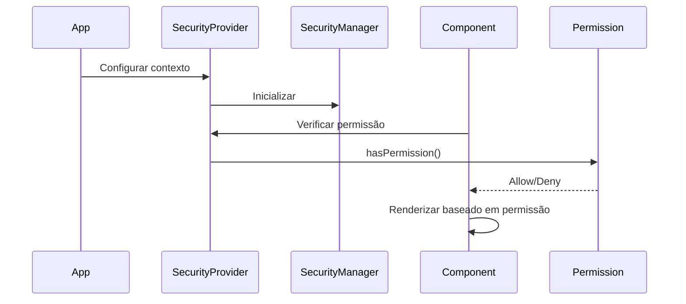

# Guia Completo de Segurança - Archbase React v3

## 📋 Índice

- [Visão Geral](#visão-geral)
- [Arquitetura do Sistema](#arquitetura-do-sistema)
- [Pacotes e Componentes](#pacotes-e-componentes)
- [Instalação e Configuração](#instalação-e-configuração)
- [Sistema de Contexto de Segurança](#sistema-de-contexto-de-segurança)
- [DataGrid com Segurança](#datagrid-com-segurança)
- [Templates com Segurança](#templates-com-segurança)
- [Componentes de UI](#componentes-de-ui)
- [Hooks de Segurança](#hooks-de-segurança)
- [Exemplos Práticos](#exemplos-práticos)
- [Migração e Compatibilidade](#migração-e-compatibilidade)
- [Troubleshooting](#troubleshooting)

---

## 🎯 Visão Geral

O Archbase React v3 oferece um sistema de segurança completo e flexível que permite:

- **Controle de acesso baseado em permissões**
- **Segurança integrada em componentes (DataGrid, Templates)**
- **Sistema de contexto opcional e não-invasivo**
- **Componentes de gerenciamento de usuários, grupos e permissões**
- **100% compatível com código existente**

### ✨ Principais Características

- ✅ **Não-invasivo**: Funciona apenas quando ativado
- ✅ **Flexível**: Integração opcional em qualquer nível
- ✅ **Performático**: Verificações otimizadas
- ✅ **Escalável**: Suporta sistemas simples e complexos
- ✅ **Type-Safe**: Totalmente tipado em TypeScript

---

## 🏗️ Arquitetura do Sistema

### Separação de Responsabilidades

```mermaid
graph TD
    A[@archbase/security] --> B[Core Logic]
    A --> C[Services]
    A --> D[Types & DTOs]
    
    E[@archbase/security-ui] --> F[Modals]
    E --> G[Views]
    E --> H[Complex Components]
    
    I[@archbase/template] --> J[Templates]
    I --> K[Security Wrappers]
    
    L[@archbase/components] --> M[DataGrid Security]
    L --> N[Form Components]
    
    E --> A
    I --> E
    L --> A
```

### Fluxo de Segurança



---

## 📦 Pacotes e Componentes

### `@archbase/security` (Core)

```typescript
// Serviços principais
export { ArchbaseSecurityManager } from '@archbase/security';
export { ArchbaseUserService } from '@archbase/security';
export { ArchbaseGroupService } from '@archbase/security';

// Contextos e Hooks
export { ArchbaseSecurityProvider } from '@archbase/security';
export { useArchbaseSecurity } from '@archbase/security';

// Types
export type { UserDto, GroupDto, ProfileDto } from '@archbase/security';
```

### `@archbase/security-ui` (UI Components)

```typescript
// Modais de gerenciamento
export { UserModal } from '@archbase/security-ui';
export { GroupModal } from '@archbase/security-ui';
export { ProfileModal } from '@archbase/security-ui';

// Views complexas
export { ArchbaseSecurityView } from '@archbase/security-ui';
export { ArchbaseApiTokenView } from '@archbase/security-ui';
```

### `@archbase/template` (Templates com Segurança)

```typescript
// Templates com segurança integrada
export { ArchbaseGridTemplate } from '@archbase/template';
export { ArchbaseFormTemplate } from '@archbase/template';
```

### `@archbase/components` (DataGrid Seguro)

```typescript
// DataGrid com segurança nativa
export { ArchbaseDataGrid } from '@archbase/components';
export { ArchbaseDataGridColumn } from '@archbase/components';
```

---

## 🚀 Instalação e Configuração

### 1. Instalação dos Pacotes

```bash
npm install @archbase/security @archbase/security-ui @archbase/template @archbase/components
```

### 2. Configuração Básica

```typescript
// app.tsx
import React from 'react';
import { ArchbaseSecurityProvider } from '@archbase/security';

const securityConfig = {
  apiUrl: 'https://api.exemplo.com',
  tokenStorage: 'localStorage', // ou 'sessionStorage'
  autoRefresh: true,
  refreshInterval: 300000 // 5 minutos
};

function App() {
  return (
    <ArchbaseSecurityProvider 
      resourceName="main_app" 
      config={securityConfig}
    >
      <YourApp />
    </ArchbaseSecurityProvider>
  );
}
```

### 3. Configuração Avançada com Manager Customizado

```typescript
// security-config.ts
import { ArchbaseSecurityManager } from '@archbase/security';

class CustomSecurityManager extends ArchbaseSecurityManager {
  async hasPermission(permission: string): Promise<boolean> {
    // Lógica customizada de verificação
    const userPermissions = await this.getUserPermissions();
    return userPermissions.includes(permission);
  }
  
  async registerAction(action: string, description?: string): Promise<void> {
    // Lógica customizada de registro
    console.log(`Registering action: ${action} - ${description}`);
  }
}

// app.tsx
import { CustomSecurityManager } from './security-config';

const securityManager = new CustomSecurityManager();

function App() {
  return (
    <ArchbaseSecurityProvider 
      manager={securityManager}
      resourceName="app"
    >
      <YourApp />
    </ArchbaseSecurityProvider>
  );
}
```

---

## 🛡️ Sistema de Contexto de Segurança

### Configuração do Provider

```typescript
import { ArchbaseSecurityProvider } from '@archbase/security';

// Configuração simples
<ArchbaseSecurityProvider resourceName="user_management">
  <UserManagementComponent />
</ArchbaseSecurityProvider>

// Configuração avançada
<ArchbaseSecurityProvider 
  resourceName="admin_panel"
  resourceDescription="Painel Administrativo"
  autoRegisterActions={true}
  fallbackComponent={<UnauthorizedMessage />}
  onSecurityReady={(manager) => console.log('Security ready:', manager)}
  onAccessDenied={(resource) => console.log('Access denied:', resource)}
>
  <AdminPanel />
</ArchbaseSecurityProvider>
```

### Usando Hooks de Segurança

```typescript
import { useArchbaseSecurity, useArchbasePermissionCheck } from '@archbase/security';

function MyComponent() {
  const security = useArchbaseSecurity();
  const canEdit = useArchbasePermissionCheck('edit_users');
  const canDelete = useArchbasePermissionCheck('delete_users');

  if (!security.isAvailable) {
    return <div>Carregando permissões...</div>;
  }

  return (
    <div>
      <h1>Gerenciamento de Usuários</h1>
      
      {canEdit && (
        <button onClick={handleEdit}>
          Editar Usuário
        </button>
      )}
      
      {canDelete && (
        <button onClick={handleDelete}>
          Excluir Usuário
        </button>
      )}
    </div>
  );
}
```

---

## 📊 DataGrid com Segurança

### Uso Básico com Segurança de Coluna

```typescript
import { ArchbaseDataGrid, ArchbaseDataGridColumn } from '@archbase/components';

function UserDataGrid() {
  return (
    <ArchbaseDataGrid 
      dataSource={userDataSource}
      resourceName="user_grid"
      resourceDescription="Lista de Usuários"
    >
      <Columns>
        {/* Coluna sempre visível */}
        <ArchbaseDataGridColumn 
          dataField="name" 
          header="Nome" 
          dataType="text" 
        />
        
        {/* Coluna protegida por permissão */}
        <ArchbaseDataGridColumn 
          dataField="email" 
          header="Email" 
          dataType="text"
          viewPermission="view_user_email"
          fallbackContent="***@***.***"
        />
        
        {/* Coluna sensível - oculta se sem permissão */}
        <ArchbaseDataGridColumn 
          dataField="salary" 
          header="Salário" 
          dataType="currency"
          viewPermission="view_user_salary"
          hideWhenNoPermission={true}
        />
        
        {/* Coluna com fallback customizado */}
        <ArchbaseDataGridColumn 
          dataField="phone" 
          header="Telefone" 
          dataType="text"
          viewPermission="view_user_contact"
          fallbackContent={<span style={{color: 'red'}}>🔒 Restrito</span>}
        />
      </Columns>
    </ArchbaseDataGrid>
  );
}
```

### Configuração Avançada de Segurança no DataGrid

```typescript
function AdvancedSecureDataGrid() {
  return (
    <ArchbaseDataGrid 
      dataSource={dataSource}
      resourceName="financial_data"
      resourceDescription="Dados Financeiros"
      columnSecurityOptions={{
        defaultFallback: "🔒 Acesso Negado",
        hideByDefault: false,
        permissionPrefix: "finance_",
        autoRegisterPermissions: true
      }}
    >
      <Columns>
        <ArchbaseDataGridColumn 
          dataField="client" 
          header="Cliente" 
          dataType="text"
        />
        
        {/* Com prefixo vira "finance_view_revenue" */}
        <ArchbaseDataGridColumn 
          dataField="revenue" 
          header="Receita" 
          dataType="currency"
          viewPermission="view_revenue"
        />
        
        {/* Permissão futura para edição */}
        <ArchbaseDataGridColumn 
          dataField="cost" 
          header="Custo" 
          dataType="currency"
          viewPermission="view_cost"
          editPermission="edit_cost"
          fallbackContent="Confidencial"
        />
      </Columns>
    </ArchbaseDataGrid>
  );
}
```

### DataGrid sem Segurança (Comportamento Padrão)

```typescript
// Funciona exatamente como antes - 100% compatível
function RegularDataGrid() {
  return (
    <ArchbaseDataGrid dataSource={dataSource}>
      <Columns>
        <ArchbaseDataGridColumn dataField="name" header="Nome" />
        <ArchbaseDataGridColumn dataField="email" header="Email" />
        <ArchbaseDataGridColumn dataField="phone" header="Telefone" />
      </Columns>
    </ArchbaseDataGrid>
  );
}
```

---

## 📋 Templates com Segurança

### ArchbaseGridTemplate

```typescript
import { ArchbaseGridTemplate } from '@archbase/template';

function UserManagementGrid() {
  return (
    <ArchbaseGridTemplate
      title="Gerenciamento de Usuários"
      dataSource={userDataSource}
      filterType="advanced"
      
      // 🔐 Configuração de segurança
      resourceName="user_management"
      resourceDescription="Gerenciamento de Usuários"
      requiredPermissions={['view_users']}
      fallbackComponent={<NoPermissionMessage />}
      securityOptions={{
        autoRegisterActions: true,
        onSecurityReady: (manager) => console.log('Grid security ready'),
        onAccessDenied: (resource) => showAccessDeniedMessage(resource)
      }}
      
      // Ações de usuário com segurança automática
      userActions={{
        visible: true,
        onAddExecute: handleAdd,      // Auto-registra "add" action
        onEditExecute: handleEdit,    // Auto-registra "edit" action  
        onRemoveExecute: handleDelete, // Auto-registra "delete" action
        onViewExecute: handleView,    // Auto-registra "view" action
        allowRemove: true
      }}
      
      columns={
        <Columns>
          <ArchbaseDataGridColumn dataField="name" header="Nome" />
          <ArchbaseDataGridColumn 
            dataField="email" 
            header="Email"
            viewPermission="view_user_email" 
          />
        </Columns>
      }
    />
  );
}
```

### ArchbaseFormTemplate

```typescript
import { ArchbaseFormTemplate } from '@archbase/template';

function UserFormTemplate() {
  return (
    <ArchbaseFormTemplate
      title="Cadastro de Usuário"
      dataSource={userDataSource}
      
      // 🔐 Segurança no formulário
      resourceName="user_form"
      requiredPermissions={['create_user', 'edit_user']}
      
      onSave={handleSave}
      onCancel={handleCancel}
    >
      <ArchbaseEdit 
        label="Nome" 
        dataSource={userDataSource} 
        dataField="name" 
      />
      
      {/* Campo com segurança condicional */}
      <ArchbaseSecureFormField permission="edit_user_email">
        <ArchbaseEdit 
          label="Email" 
          dataSource={userDataSource} 
          dataField="email" 
        />
      </ArchbaseSecureFormField>
    </ArchbaseFormTemplate>
  );
}
```

---

## 🎭 Componentes de UI

### Modais de Gerenciamento

```typescript
import { 
  UserModal, 
  GroupModal, 
  ProfileModal 
} from '@archbase/security-ui';

function UserManagementComponent() {
  const [userModalOpen, setUserModalOpen] = useState(false);
  const [groupModalOpen, setGroupModalOpen] = useState(false);

  return (
    <div>
      {/* Modal de Usuário */}
      <UserModal
        dataSource={userDataSource}
        opened={userModalOpen}
        onClickOk={(user, result) => {
          console.log('User saved:', user);
          setUserModalOpen(false);
        }}
        onClickCancel={() => setUserModalOpen(false)}
        onCustomSave={async (user, callback) => {
          try {
            await userService.save(user);
            callback(true);
          } catch (error) {
            callback(false);
          }
        }}
        options={{
          showNickname: true,
          showActive: true,
          showProfiles: true,
          showGroups: true,
          customContentBefore: <WelcomeMessage />,
          customContentAfter: <AdditionalFields />
        }}
      />

      {/* Modal de Grupo */}
      <GroupModal
        dataSource={groupDataSource}
        opened={groupModalOpen}
        onClickOk={(group) => setGroupModalOpen(false)}
        onClickCancel={() => setGroupModalOpen(false)}
      />
    </div>
  );
}
```

### Views Complexas

```typescript
import { ArchbaseSecurityView } from '@archbase/security-ui';

function AdminSecurityPanel() {
  return (
    <ArchbaseSecurityView
      height="600px"
      defaultTab="users"
      userModalOptions={{
        showNickname: true,
        showProfiles: true,
        showGroups: true
      }}
      groupModalOptions={{
        showUsers: true,
        showPermissions: true
      }}
      onUserCreated={(user) => console.log('User created:', user)}
      onUserUpdated={(user) => console.log('User updated:', user)}
      onUserDeleted={(userId) => console.log('User deleted:', userId)}
    />
  );
}
```

---

## 🪝 Hooks de Segurança

### useArchbaseSecurity

```typescript
import { useArchbaseSecurity } from '@archbase/security';

function MySecureComponent() {
  const security = useArchbaseSecurity();

  // Verificar se segurança está disponível
  if (!security.isAvailable) {
    return <div>Sistema funcionando sem segurança</div>;
  }

  // Verificar permissão específica
  const canEdit = security.hasPermission('edit_users');
  const canDelete = security.hasPermission('delete_users');

  // Registrar ação dinamicamente
  React.useEffect(() => {
    security.registerAction('view_dashboard', 'Visualizar Dashboard');
  }, [security]);

  return (
    <div>
      {canEdit && <EditButton />}
      {canDelete && <DeleteButton />}
    </div>
  );
}
```

### useArchbasePermissionCheck

```typescript
import { useArchbasePermissionCheck } from '@archbase/security';

function ConditionalComponent() {
  const canViewSalary = useArchbasePermissionCheck('view_salary');
  const canViewPersonalData = useArchbasePermissionCheck('view_personal_data');

  return (
    <div>
      <h3>Informações do Funcionário</h3>
      <p>Nome: João Silva</p>
      
      {canViewPersonalData && (
        <p>CPF: 123.456.789-00</p>
      )}
      
      {canViewSalary && (
        <p>Salário: R$ 5.000,00</p>
      )}
    </div>
  );
}
```

### useArchbaseSecureForm

```typescript
import { useArchbaseSecureForm } from '@archbase/security';

function SecureForm() {
  const {
    hasPermission,
    registerFormAction,
    canSubmit,
    securityErrors
  } = useArchbaseSecureForm({
    resourceName: 'user_form',
    requiredPermissions: ['create_user']
  });

  React.useEffect(() => {
    registerFormAction('submit_user_form', 'Submeter Formulário de Usuário');
  }, [registerFormAction]);

  return (
    <form>
      <input type="text" placeholder="Nome" />
      
      {hasPermission('edit_sensitive_data') && (
        <input type="text" placeholder="Dados Sensíveis" />
      )}
      
      <button 
        type="submit" 
        disabled={!canSubmit}
      >
        Salvar
      </button>
      
      {securityErrors.length > 0 && (
        <div className="errors">
          {securityErrors.map(error => (
            <p key={error}>{error}</p>
          ))}
        </div>
      )}
    </form>
  );
}
```

---

## 🎯 Exemplos Práticos

### Exemplo 1: Sistema de RH Completo

```typescript
// hr-system.tsx
import React from 'react';
import { ArchbaseSecurityProvider } from '@archbase/security';
import { ArchbaseGridTemplate } from '@archbase/template';
import { ArchbaseDataGridColumn, Columns } from '@archbase/components';

function HRSystem() {
  return (
    <ArchbaseSecurityProvider 
      resourceName="hr_system"
      resourceDescription="Sistema de Recursos Humanos"
    >
      <ArchbaseGridTemplate
        title="Funcionários"
        dataSource={employeeDataSource}
        filterType="advanced"
        
        resourceName="employee_management"
        requiredPermissions={['access_hr_system']}
        
        userActions={{
          visible: true,
          onAddExecute: () => setEmployeeModalOpen(true),
          onEditExecute: () => handleEditEmployee(),
          onRemoveExecute: () => handleDeleteEmployee(),
          allowRemove: true
        }}
        
        columnSecurityOptions={{
          permissionPrefix: "hr_",
          defaultFallback: "🔒 Confidencial"
        }}
        
        columns={
          <Columns>
            {/* Dados básicos - sempre visíveis */}
            <ArchbaseDataGridColumn 
              dataField="name" 
              header="Nome" 
              dataType="text" 
            />
            
            <ArchbaseDataGridColumn 
              dataField="department" 
              header="Departamento" 
              dataType="text" 
            />
            
            {/* Dados sensíveis com permissões */}
            <ArchbaseDataGridColumn 
              dataField="cpf" 
              header="CPF" 
              dataType="text"
              viewPermission="view_personal_data"
              fallbackContent="***.***.***-**"
            />
            
            <ArchbaseDataGridColumn 
              dataField="salary" 
              header="Salário" 
              dataType="currency"
              viewPermission="view_salary"
              hideWhenNoPermission={true}
            />
            
            <ArchbaseDataGridColumn 
              dataField="performance" 
              header="Avaliação" 
              dataType="text"
              viewPermission="view_performance"
              fallbackContent="Restrito"
            />
            
            {/* Dados administrativos */}
            <ArchbaseDataGridColumn 
              dataField="admissionDate" 
              header="Data Admissão" 
              dataType="date"
              viewPermission="view_admin_data"
            />
          </Columns>
        }
      />
    </ArchbaseSecurityProvider>
  );
}
```

### Exemplo 2: Dashboard Financeiro

```typescript
// financial-dashboard.tsx
import React from 'react';
import { useArchbasePermissionCheck } from '@archbase/security';

function FinancialDashboard() {
  const canViewRevenue = useArchbasePermissionCheck('view_revenue');
  const canViewCosts = useArchbasePermissionCheck('view_costs');
  const canViewProfit = useArchbasePermissionCheck('view_profit');
  const canExportData = useArchbasePermissionCheck('export_financial_data');

  return (
    <div className="financial-dashboard">
      <h1>Dashboard Financeiro</h1>
      
      <div className="metrics-grid">
        {canViewRevenue && (
          <MetricCard title="Receita" value="R$ 150.000" color="green" />
        )}
        
        {canViewCosts && (
          <MetricCard title="Custos" value="R$ 80.000" color="red" />
        )}
        
        {canViewProfit && (
          <MetricCard title="Lucro" value="R$ 70.000" color="blue" />
        )}
      </div>
      
      {canViewRevenue && canViewCosts && (
        <FinancialChart />
      )}
      
      {canExportData && (
        <button className="export-btn">
          Exportar Relatório
        </button>
      )}
    </div>
  );
}
```

### Exemplo 3: Formulário com Campos Condicionais

```typescript
// conditional-form.tsx
import React from 'react';
import { ArchbaseSecureFormField } from '@archbase/security';
import { ArchbaseEdit } from '@archbase/components';

function CustomerForm() {
  return (
    <ArchbaseSecurityProvider resourceName="customer_form">
      <form>
        {/* Campos básicos sempre visíveis */}
        <ArchbaseEdit 
          label="Nome da Empresa"
          dataSource={customerDataSource}
          dataField="companyName"
        />
        
        <ArchbaseEdit 
          label="Email"
          dataSource={customerDataSource}
          dataField="email"
        />
        
        {/* Campos condicionais por permissão */}
        <ArchbaseSecureFormField permission="view_financial_data">
          <ArchbaseEdit 
            label="Faturamento Anual"
            dataSource={customerDataSource}
            dataField="annualRevenue"
            dataType="currency"
          />
        </ArchbaseSecureFormField>
        
        <ArchbaseSecureFormField permission="view_credit_info">
          <ArchbaseEdit 
            label="Score de Crédito"
            dataSource={customerDataSource}
            dataField="creditScore"
            dataType="number"
          />
        </ArchbaseSecureFormField>
        
        <ArchbaseSecureFormField 
          permission="edit_sensitive_data"
          fallback={<p>📝 Dados restritos - entre em contato com o administrador</p>}
        >
          <ArchbaseEdit 
            label="Informações Confidenciais"
            dataSource={customerDataSource}
            dataField="confidentialNotes"
            dataType="textarea"
          />
        </ArchbaseSecureFormField>
      </form>
    </ArchbaseSecurityProvider>
  );
}
```

### Exemplo 4: Sistema Multi-tenant

```typescript
// multi-tenant-app.tsx
import React from 'react';
import { ArchbaseSecurityProvider } from '@archbase/security';

class TenantSecurityManager extends ArchbaseSecurityManager {
  constructor(private tenantId: string) {
    super();
  }
  
  async hasPermission(permission: string): Promise<boolean> {
    // Verificar permissão específica do tenant
    const response = await fetch(`/api/tenants/${this.tenantId}/permissions/${permission}`);
    return response.ok;
  }
  
  async getUserPermissions(): Promise<string[]> {
    const response = await fetch(`/api/tenants/${this.tenantId}/user-permissions`);
    return response.json();
  }
}

function MultiTenantApp({ tenantId }: { tenantId: string }) {
  const securityManager = React.useMemo(
    () => new TenantSecurityManager(tenantId), 
    [tenantId]
  );

  return (
    <ArchbaseSecurityProvider 
      manager={securityManager}
      resourceName={`tenant_${tenantId}`}
      resourceDescription={`Sistema do Tenant ${tenantId}`}
    >
      <TenantDashboard tenantId={tenantId} />
    </ArchbaseSecurityProvider>
  );
}

function TenantDashboard({ tenantId }: { tenantId: string }) {
  return (
    <ArchbaseGridTemplate
      title={`Dados do Tenant ${tenantId}`}
      dataSource={tenantDataSource}
      resourceName="tenant_data"
      
      columns={
        <Columns>
          <ArchbaseDataGridColumn 
            dataField="data" 
            header="Dados Públicos" 
          />
          
          {/* Dados específicos do tenant */}
          <ArchbaseDataGridColumn 
            dataField="tenantSpecificData" 
            header="Dados Específicos"
            viewPermission={`tenant_${tenantId}_view_specific`}
          />
        </Columns>
      }
    />
  );
}
```

---

## 🔄 Migração e Compatibilidade

### Código Existente (Sem Alterações)

```typescript
// ✅ Continua funcionando exatamente igual
function ExistingDataGrid() {
  return (
    <ArchbaseDataGrid dataSource={dataSource}>
      <Columns>
        <ArchbaseDataGridColumn dataField="name" header="Nome" />
        <ArchbaseDataGridColumn dataField="email" header="Email" />
      </Columns>
    </ArchbaseDataGrid>
  );
}
```

### Adicionando Segurança Gradualmente

```typescript
// Passo 1: Adicionar contexto (opcional)
function Step1_AddContext() {
  return (
    <ArchbaseSecurityProvider resourceName="my_app">
      <ExistingDataGrid />
    </ArchbaseSecurityProvider>
  );
}

// Passo 2: Adicionar permissões específicas
function Step2_AddPermissions() {
  return (
    <ArchbaseDataGrid 
      dataSource={dataSource}
      resourceName="user_data" // Ativa segurança
    >
      <Columns>
        <ArchbaseDataGridColumn dataField="name" header="Nome" />
        <ArchbaseDataGridColumn 
          dataField="email" 
          header="Email"
          viewPermission="view_email" // Nova permissão
        />
      </Columns>
    </ArchbaseDataGrid>
  );
}

// Passo 3: Configuração avançada
function Step3_AdvancedConfig() {
  return (
    <ArchbaseDataGrid 
      dataSource={dataSource}
      resourceName="user_data"
      columnSecurityOptions={{
        defaultFallback: "🔒 Restrito",
        permissionPrefix: "user_"
      }}
    >
      <Columns>
        <ArchbaseDataGridColumn dataField="name" header="Nome" />
        <ArchbaseDataGridColumn 
          dataField="email" 
          header="Email"
          viewPermission="view_email"
          fallbackContent="***@***.***"
        />
      </Columns>
    </ArchbaseDataGrid>
  );
}
```

---

## 🔧 Troubleshooting

### Problemas Comuns

#### 1. Segurança não funciona

```typescript
// ❌ Problema: ResourceName não configurado
<ArchbaseDataGrid dataSource={dataSource}>
  <Columns>
    <ArchbaseDataGridColumn 
      dataField="email" 
      viewPermission="view_email" // Não funciona sem resourceName
    />
  </Columns>
</ArchbaseDataGrid>

// ✅ Solução: Adicionar resourceName
<ArchbaseDataGrid 
  dataSource={dataSource}
  resourceName="users" // Ativa segurança
>
  <Columns>
    <ArchbaseDataGridColumn 
      dataField="email" 
      viewPermission="view_email" // Agora funciona
    />
  </Columns>
</ArchbaseDataGrid>
```

#### 2. Hook usado fora do contexto

```typescript
// ❌ Problema: Hook fora do Provider
function MyComponent() {
  const security = useArchbaseSecurity(); // Erro!
  return <div>...</div>;
}

// ✅ Solução: Envolver com Provider
<ArchbaseSecurityProvider resourceName="app">
  <MyComponent />
</ArchbaseSecurityProvider>
```

#### 3. Permissões não carregam

```typescript
// ❌ Problema: Manager não configurado corretamente
class BrokenSecurityManager extends ArchbaseSecurityManager {
  async hasPermission(permission: string): Promise<boolean> {
    // Implementação quebrada
    return false; // Sempre nega
  }
}

// ✅ Solução: Implementar corretamente
class WorkingSecurityManager extends ArchbaseSecurityManager {
  async hasPermission(permission: string): Promise<boolean> {
    try {
      const response = await fetch(`/api/permissions/${permission}`);
      return response.ok;
    } catch (error) {
      console.error('Erro ao verificar permissão:', error);
      return false; // Falha segura
    }
  }
}
```

### Debug e Logs

```typescript
// Habilitar logs de debug
<ArchbaseSecurityProvider 
  resourceName="app"
  debug={true} // Mostra logs detalhados
  onSecurityReady={(manager) => {
    console.log('Security manager ready:', manager);
  }}
  onPermissionCheck={(permission, result) => {
    console.log(`Permission ${permission}: ${result ? 'GRANTED' : 'DENIED'}`);
  }}
>
  <YourApp />
</ArchbaseSecurityProvider>
```

### Performance

```typescript
// ✅ Otimizar verificações de permissão
const securityConfig = {
  cachePermissions: true,        // Cache de permissões
  cacheTimeout: 300000,          // 5 minutos
  batchPermissionChecks: true,   // Agrupar verificações
  debounceTime: 100             // Debounce para múltiplas verificações
};

<ArchbaseSecurityProvider 
  resourceName="app"
  config={securityConfig}
>
  <YourApp />
</ArchbaseSecurityProvider>
```

---

## 📝 Conclusão

O sistema de segurança do Archbase React v3 oferece:

- **Flexibilidade total**: Use apenas o que precisar
- **Compatibilidade**: Funciona com código existente
- **Performance**: Otimizado para aplicações grandes
- **Escalabilidade**: Desde apps simples até sistemas complexos
- **Type Safety**: Totalmente tipado em TypeScript

### Links Úteis

- 📖 [Documentação da API](./api-reference.md)
- 🎯 [Exemplos Avançados](./advanced-examples.md)
- 🔧 [Guia de Migração](./migration-guide.md)
- 🐛 [Troubleshooting Detalhado](./troubleshooting.md)

---

**Pronto para começar? Escolha o nível de segurança que sua aplicação precisa e implemente gradualmente!** 🚀