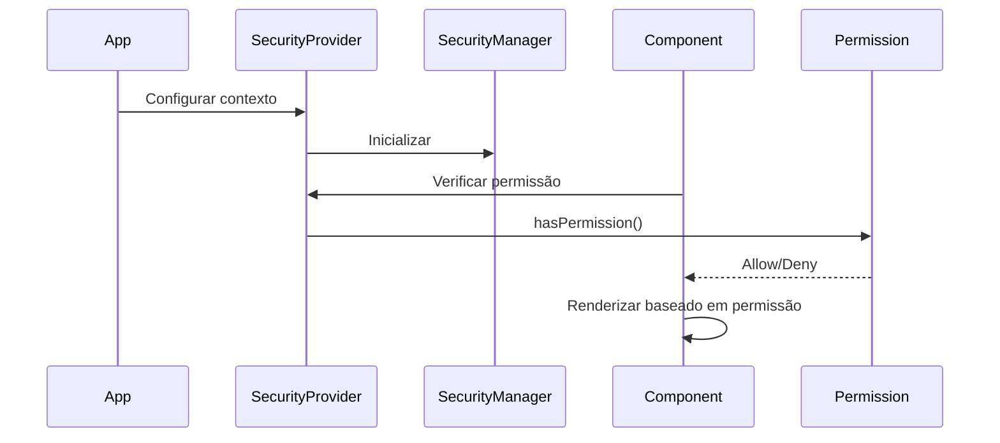

# Guia Completo de Segurança - Archbase React v3

## 📋 Índice

- [Visão Geral](#visão-geral)
- [Arquitetura do Sistema](#arquitetura-do-sistema)
- [Domínio de Segurança](#domínio-de-segurança)
- [Autenticação](#autenticação)
- [Multi-tenancy](#multi-tenancy)
- [Gerenciamento de Segurança](#gerenciamento-de-segurança)
- [Pacotes e Componentes](#pacotes-e-componentes)
- [Instalação e Configuração](#instalação-e-configuração)
- [Sistema de Contexto de Segurança](#sistema-de-contexto-de-segurança)
- [DataGrid com Segurança](#datagrid-com-segurança)
- [Templates com Segurança](#templates-com-segurança)
- [Componentes de UI](#componentes-de-ui)
- [Hooks de Segurança](#hooks-de-segurança)
- [Serviços](#serviços)
- [Exemplos Práticos](#exemplos-práticos)
- [Migração e Compatibilidade](#migração-e-compatibilidade)
- [Troubleshooting](#troubleshooting)

---

## 🎯 Visão Geral

O Archbase Security é um sistema completo de segurança e autenticação que oferece:

- **Autenticação Multi-Modal**: Login básico, contextual, flexível e social
- **Multi-tenancy**: Suporte completo para aplicações multi-tenant
- **Controle de Acesso Baseado em Recursos (RBAC)**: Gerenciamento granular de permissões
- **Segurança em Nível de Componente**: Integração nativa com componentes React
- **Hooks Especializados**: Hooks React para todas as operações de segurança
- **Gerenciamento de Tokens**: Renovação automática e gerenciamento de ciclo de vida
- **API Tokens**: Sistema completo de tokens de API para integrações
- **Sistema de contexto opcional e não-invasivo**
- **100% compatível com código existente**

### ✨ Principais Características

- ✅ **Não-invasivo**: Funciona apenas quando ativado
- ✅ **Flexível**: Integração opcional em qualquer nível
- ✅ **Performático**: Verificações otimizadas
- ✅ **Escalável**: Suporta sistemas simples e complexos
- ✅ **Type-Safe**: Totalmente tipado em TypeScript
- ✅ **Multi-Modal**: Suporte a diferentes tipos de autenticação
- ✅ **Multi-Tenant**: Arquitetura para aplicações multi-tenant

---

## 🏗️ Arquitetura do Sistema

### Separação de Responsabilidades

```mermaid
graph TD
    A[@archbase/security] --> B[Core Logic]
    A --> C[Services]
    A --> D[Types & DTOs]
    
    E[@archbase/security-ui] --> F[Modals]
    E --> G[Views]
    E --> H[Complex Components]
    
    I[@archbase/template] --> J[Templates]
    I --> K[Security Wrappers]
    
    L[@archbase/components] --> M[DataGrid Security]
    L --> N[Form Components]
    
    E --> A
    I --> E
    L --> A
```

### Fluxo de Segurança



---

## 🏠 Domínio de Segurança

### DTOs Principais

#### UserDto
```typescript
export class UserDto extends SecurityDto {
  userName: string;
  email: string;
  password?: string;
  name: string;
  avatarColor?: string;
  phone?: string;
  allowPasswordChange: boolean;
  mustChangePassword: boolean;
  allowMultipleLogins: boolean;
  unlimitedAccessTime: boolean;
  activationToken?: string;
  passwordResetToken?: string;
  isNewUser: boolean;
  groups: GroupDto[];
  profiles: ProfileDto[];
  accessSchedule?: AccessScheduleDto;
}
```

#### GroupDto
```typescript
export class GroupDto extends SecurityDto {
  groupName: string;
  description: string;
  isNewGroup: boolean;
  users: UserDto[];
  profiles: ProfileDto[];
}
```

#### ProfileDto
```typescript
export class ProfileDto extends SecurityDto {
  profileName: string;
  description: string;
  isNewProfile: boolean;
  users: UserDto[];
  groups: GroupDto[];
}
```

#### ApiTokenDto
```typescript
export class ApiTokenDto extends SecurityDto {
  email: string;
  name: string;
  description: string;
  tokenValue: string;
  expirationDate: Date;
  isNovoToken: boolean;
}
```

#### AccessScheduleDto
```typescript
export class AccessScheduleDto {
  id: string;
  description: string;
  intervals: AccessIntervalDto[];
}

export class AccessIntervalDto {
  dayOfWeek: number; // 0-6 (Domingo-Sábado)
  startTime: string; // "HH:mm"
  endTime: string;   // "HH:mm"
}
```

---

## 🔐 Autenticação

### Interface ArchbaseAuthenticator

O sistema suporta múltiplos métodos de autenticação através da interface `ArchbaseAuthenticator`:

#### Métodos Básicos (Obrigatórios)
```typescript
interface ArchbaseAuthenticator {
  // Login básico
  login(username: string, password: string): Promise<ArchbaseAccessToken>;
  
  // Renovação de token
  refreshToken(refresh_token: string): Promise<ArchbaseAccessToken>;
  
  // Reset de senha
  sendResetPasswordEmail(email: string): Promise<void>;
  resetPassword(email: string, passwordResetToken: string, newPassword: string): Promise<void>;
}
```

#### Métodos Avançados (Opcionais)
```typescript
interface ArchbaseAuthenticator {
  // Login contextual com enrichers específicos
  loginWithContext?(request: ContextualAuthenticationRequest): Promise<ContextualAuthenticationResponse>;
  
  // Login flexível (email ou telefone)
  loginFlexible?(request: FlexibleLoginRequest): Promise<ContextualAuthenticationResponse>;
  
  // Login via provedores sociais
  loginSocial?(request: SocialLoginRequest): Promise<ContextualAuthenticationResponse>;
  
  // Registro de usuário
  register?(request: RegisterUserRequest): Promise<{email: string; businessId?: string; message: string}>;
  
  // Suporte a contextos
  getSupportedContexts?(): Promise<SupportedContextsResponse>;
  validateContext?(context: string): Promise<ContextValidationResponse>;
}
```

### Tipos de Login

#### 1. Login Básico
```typescript
const { login } = useArchbaseAuthenticationManager({});

await login("user@example.com", "password", true);
```

#### 2. Login Contextual
```typescript
const { loginWithContext } = useArchbaseAuthenticationManager({});

await loginWithContext({
  email: "user@example.com",
  password: "password",
  context: "VENDAS",
  enrichers: {
    location: "SP",
    department: "SALES"
  }
});
```

#### 3. Login Flexível
```typescript
const { loginFlexible } = useArchbaseAuthenticationManager({});

// Login por email
await loginFlexible({
  identifier: "user@example.com",
  password: "password",
  identifierType: "EMAIL"
});

// Login por telefone
await loginFlexible({
  identifier: "+5511999999999",
  password: "password",
  identifierType: "PHONE"
});
```

#### 4. Login Social
```typescript
const { loginSocial } = useArchbaseAuthenticationManager({});

await loginSocial({
  provider: "GOOGLE",
  token: "google_oauth_token",
  additionalData: {
    deviceId: "device123"
  }
});
```

### Capacidades Dinâmicas

O hook `useArchbaseAuthenticationManager` detecta automaticamente as capacidades do authenticator:

```typescript
const {
  capabilities: {
    hasContextualLogin,
    hasFlexibleLogin,
    hasSocialLogin,
    hasRegistration,
    hasContextSupport
  }
} = useArchbaseAuthenticationManager({});

// Renderizar UI baseada nas capacidades
{hasContextualLogin && <ContextualLoginForm />}
{hasSocialLogin && <SocialLoginButtons />}
```

---

## 🏢 Multi-tenancy

### ArchbaseTenantManager

Gerenciamento centralizado de tenants em aplicações multi-tenant:

```typescript
// Singleton para gerenciar tenant atual
const tenantManager = ArchbaseTenantManager.getInstance();

// Definir tenant atual
tenantManager.setCurrentTenant({
  id: "tenant-123",
  code: "EMPRESA_A",
  descricao: "Empresa A Ltda",
  imagemApresentacao: "/logos/empresa-a.png"
});

// Observar mudanças de tenant
tenantManager.currentTenant$.subscribe(tenant => {
  console.log('Tenant changed:', tenant);
});

// Definir tenants disponíveis
tenantManager.setAvailableTenants([
  { id: "tenant-123", descricao: "Empresa A Ltda" },
  { id: "tenant-456", descricao: "Empresa B Ltda" }
]);
```

### Hook para Componentes React
```typescript
import { useArchbaseTenantManager } from '@archbase/security';

function TenantSelector() {
  const tenantManager = useArchbaseTenantManager();
  const [currentTenant, setCurrentTenant] = useState(null);
  const [availableTenants, setAvailableTenants] = useState([]);

  useEffect(() => {
    const currentSub = tenantManager.currentTenant$.subscribe(setCurrentTenant);
    const availableSub = tenantManager.availableTenants$.subscribe(setAvailableTenants);
    
    return () => {
      currentSub.unsubscribe();
      availableSub.unsubscribe();
    };
  }, []);

  return (
    <Select
      value={currentTenant?.id || ''}
      onChange={(tenantId) => {
        const tenant = availableTenants.find(t => t.id === tenantId);
        tenantManager.setCurrentTenant(tenant);
      }}
    >
      {availableTenants.map(tenant => (
        <option key={tenant.id} value={tenant.id}>
          {tenant.descricao}
        </option>
      ))}
    </Select>
  );
}
```

### Headers Automáticos para APIs

O TenantManager adiciona automaticamente o header `X-TENANT-ID` em todas as requisições:

```typescript
// Todos os services automaticamente incluem o header do tenant
const userService = new ArchbaseUserService(apiClient);
userService.findAll(); // Automaticamente inclui X-TENANT-ID: tenant-123
```

---

## 🛡️ Gerenciamento de Segurança

### ArchbaseSecurityManager

Gerencia permissões por recurso na aplicação:

```typescript
// Criar um security manager para um recurso específico
const securityManager = new ArchbaseSecurityManager(
  "PRODUTOS",           // nome do recurso
  "Gestão de Produtos", // descrição
  false                 // isAdmin
);

// Registrar ações disponíveis
securityManager.registerAction("VIEW", "Visualizar produtos");
securityManager.registerAction("CREATE", "Criar produtos");
securityManager.registerAction("EDIT", "Editar produtos");
securityManager.registerAction("DELETE", "Excluir produtos");

// Aplicar e sincronizar com backend
await securityManager.apply(() => {
  console.log('Permissões carregadas');
});

// Verificar permissões
if (securityManager.hasPermission("CREATE")) {
  // Mostrar botão de criar
}
```

### Métodos Avançados

```typescript
// Verificar múltiplas permissões
const canManageProducts = securityManager.hasAnyPermission(["CREATE", "EDIT", "DELETE"]);
const canFullAccess = securityManager.hasAllPermissions(["VIEW", "CREATE", "EDIT", "DELETE"]);

// Informações detalhadas sobre permissão
const permissionInfo = securityManager.getPermissionInfo("CREATE");
console.log(permissionInfo);
// {
//   hasPermission: true,
//   isAdmin: false,
//   reason: "Usuário tem permissão específica"
// }

// Registrar múltiplas ações
securityManager.registerActions([
  { actionName: "EXPORT", actionDescription: "Exportar dados" },
  { actionName: "IMPORT", actionDescription: "Importar dados" }
]);

// Obter todas as permissões
const permissions = securityManager.getPermissions();
console.log('Permissões do usuário:', permissions);
```

---

## 📦 Pacotes e Componentes

### `@archbase/security` (Core)

```typescript
// Core Components
export { ArchbaseSecurityManager } from '@archbase/security';
export { ArchbaseTenantManager, useArchbaseTenantManager } from '@archbase/security';
export { ArchbaseLogin } from '@archbase/security';

// Services
export { ArchbaseUserService } from '@archbase/security';
export { ArchbaseGroupService } from '@archbase/security';
export { ArchbaseProfileService } from '@archbase/security';
export { ArchbaseResourceService } from '@archbase/security';
export { ArchbaseApiTokenService } from '@archbase/security';

// Authentication
export type { ArchbaseAuthenticator } from '@archbase/security';
export type { ArchbaseAccessToken, ArchbaseTokenManager } from '@archbase/security';

// Hooks
export { 
  useArchbaseSecurityManager,
  useArchbaseAuthenticationManager,
  useArchbaseGetLoggedUser,
  useArchbaseGetCurrentToken,
  useArchbaseResetPassword
} from '@archbase/security';

// Context and Providers
export { ArchbaseSecurityProvider } from '@archbase/security';
export { useArchbaseSecurity, useArchbasePermissionCheck } from '@archbase/security';

// Domain Types
export type { 
  UserDto, 
  GroupDto, 
  ProfileDto, 
  ApiTokenDto,
  ResourceDto,
  AccessScheduleDto,
  AccessIntervalDto,
  SecurityDto
} from '@archbase/security';

// Authentication Types
export type {
  ContextualAuthenticationRequest,
  ContextualAuthenticationResponse,
  FlexibleLoginRequest,
  SocialLoginRequest,
  RegisterUserRequest,
  SupportedContextsResponse,
  ContextValidationResponse
} from '@archbase/security';
```

### `@archbase/security-ui` (UI Components)

```typescript
// Modais de gerenciamento
export { UserModal } from '@archbase/security-ui';
export { GroupModal } from '@archbase/security-ui';
export { ProfileModal } from '@archbase/security-ui';

// Views complexas
export { ArchbaseSecurityView } from '@archbase/security-ui';
export { ArchbaseApiTokenView } from '@archbase/security-ui';
```

### `@archbase/template` (Templates com Segurança)

```typescript
// Templates com segurança integrada
export { ArchbaseGridTemplate } from '@archbase/template';
export { ArchbaseFormTemplate } from '@archbase/template';
```

### `@archbase/components` (DataGrid Seguro)

```typescript
// DataGrid com segurança nativa
export { ArchbaseDataGrid } from '@archbase/components';
export { ArchbaseDataGridColumn } from '@archbase/components';
```

---

## 🚀 Instalação e Configuração

### 1. Instalação dos Pacotes

```bash
npm install @archbase/security @archbase/security-ui @archbase/template @archbase/components
```

### 2. Configuração Básica

```typescript
// app.tsx
import React from 'react';
import { ArchbaseSecurityProvider } from '@archbase/security';

const securityConfig = {
  apiUrl: 'https://api.exemplo.com',
  tokenStorage: 'localStorage', // ou 'sessionStorage'
  autoRefresh: true,
  refreshInterval: 300000 // 5 minutos
};

function App() {
  return (
    <ArchbaseSecurityProvider 
      resourceName="main_app" 
      config={securityConfig}
    >
      <YourApp />
    </ArchbaseSecurityProvider>
  );
}
```

### 3. Configuração Avançada com Manager Customizado

```typescript
// security-config.ts
import { ArchbaseSecurityManager } from '@archbase/security';

class CustomSecurityManager extends ArchbaseSecurityManager {
  async hasPermission(permission: string): Promise<boolean> {
    // Lógica customizada de verificação
    const userPermissions = await this.getUserPermissions();
    return userPermissions.includes(permission);
  }
  
  async registerAction(action: string, description?: string): Promise<void> {
    // Lógica customizada de registro
    console.log(`Registering action: ${action} - ${description}`);
  }
}

// app.tsx
import { CustomSecurityManager } from './security-config';

const securityManager = new CustomSecurityManager();

function App() {
  return (
    <ArchbaseSecurityProvider 
      manager={securityManager}
      resourceName="app"
    >
      <YourApp />
    </ArchbaseSecurityProvider>
  );
}
```

---

## 🛡️ Sistema de Contexto de Segurança

### Configuração do Provider

```typescript
import { ArchbaseSecurityProvider } from '@archbase/security';

// Configuração simples
<ArchbaseSecurityProvider resourceName="user_management">
  <UserManagementComponent />
</ArchbaseSecurityProvider>

// Configuração avançada
<ArchbaseSecurityProvider 
  resourceName="admin_panel"
  resourceDescription="Painel Administrativo"
  autoRegisterActions={true}
  fallbackComponent={<UnauthorizedMessage />}
  onSecurityReady={(manager) => console.log('Security ready:', manager)}
  onAccessDenied={(resource) => console.log('Access denied:', resource)}
>
  <AdminPanel />
</ArchbaseSecurityProvider>
```

### Usando Hooks de Segurança

```typescript
import { useArchbaseSecurity, useArchbasePermissionCheck } from '@archbase/security';

function MyComponent() {
  const security = useArchbaseSecurity();
  const canEdit = useArchbasePermissionCheck('edit_users');
  const canDelete = useArchbasePermissionCheck('delete_users');

  if (!security.isAvailable) {
    return <div>Carregando permissões...</div>;
  }

  return (
    <div>
      <h1>Gerenciamento de Usuários</h1>
      
      {canEdit && (
        <button onClick={handleEdit}>
          Editar Usuário
        </button>
      )}
      
      {canDelete && (
        <button onClick={handleDelete}>
          Excluir Usuário
        </button>
      )}
    </div>
  );
}
```

---

## 📊 DataGrid com Segurança

### Uso Básico com Segurança de Coluna

```typescript
import { ArchbaseDataGrid, ArchbaseDataGridColumn } from '@archbase/components';

function UserDataGrid() {
  return (
    <ArchbaseDataGrid 
      dataSource={userDataSource}
      resourceName="user_grid"
      resourceDescription="Lista de Usuários"
    >
      <Columns>
        {/* Coluna sempre visível */}
        <ArchbaseDataGridColumn 
          dataField="name" 
          header="Nome" 
          dataType="text" 
        />
        
        {/* Coluna protegida por permissão */}
        <ArchbaseDataGridColumn 
          dataField="email" 
          header="Email" 
          dataType="text"
          viewPermission="view_user_email"
          fallbackContent="***@***.***"
        />
        
        {/* Coluna sensível - oculta se sem permissão */}
        <ArchbaseDataGridColumn 
          dataField="salary" 
          header="Salário" 
          dataType="currency"
          viewPermission="view_user_salary"
          hideWhenNoPermission={true}
        />
        
        {/* Coluna com fallback customizado */}
        <ArchbaseDataGridColumn 
          dataField="phone" 
          header="Telefone" 
          dataType="text"
          viewPermission="view_user_contact"
          fallbackContent={<span style={{color: 'red'}}>🔒 Restrito</span>}
        />
      </Columns>
    </ArchbaseDataGrid>
  );
}
```

### Configuração Avançada de Segurança no DataGrid

```typescript
function AdvancedSecureDataGrid() {
  return (
    <ArchbaseDataGrid 
      dataSource={dataSource}
      resourceName="financial_data"
      resourceDescription="Dados Financeiros"
      columnSecurityOptions={{
        defaultFallback: "🔒 Acesso Negado",
        hideByDefault: false,
        permissionPrefix: "finance_",
        autoRegisterPermissions: true
      }}
    >
      <Columns>
        <ArchbaseDataGridColumn 
          dataField="client" 
          header="Cliente" 
          dataType="text"
        />
        
        {/* Com prefixo vira "finance_view_revenue" */}
        <ArchbaseDataGridColumn 
          dataField="revenue" 
          header="Receita" 
          dataType="currency"
          viewPermission="view_revenue"
        />
        
        {/* Permissão futura para edição */}
        <ArchbaseDataGridColumn 
          dataField="cost" 
          header="Custo" 
          dataType="currency"
          viewPermission="view_cost"
          editPermission="edit_cost"
          fallbackContent="Confidencial"
        />
      </Columns>
    </ArchbaseDataGrid>
  );
}
```

### DataGrid sem Segurança (Comportamento Padrão)

```typescript
// Funciona exatamente como antes - 100% compatível
function RegularDataGrid() {
  return (
    <ArchbaseDataGrid dataSource={dataSource}>
      <Columns>
        <ArchbaseDataGridColumn dataField="name" header="Nome" />
        <ArchbaseDataGridColumn dataField="email" header="Email" />
        <ArchbaseDataGridColumn dataField="phone" header="Telefone" />
      </Columns>
    </ArchbaseDataGrid>
  );
}
```

---

## 📋 Templates com Segurança

### ArchbaseGridTemplate

```typescript
import { ArchbaseGridTemplate } from '@archbase/template';

function UserManagementGrid() {
  return (
    <ArchbaseGridTemplate
      title="Gerenciamento de Usuários"
      dataSource={userDataSource}
      filterType="advanced"
      
      // 🔐 Configuração de segurança
      resourceName="user_management"
      resourceDescription="Gerenciamento de Usuários"
      requiredPermissions={['view_users']}
      fallbackComponent={<NoPermissionMessage />}
      securityOptions={{
        autoRegisterActions: true,
        onSecurityReady: (manager) => console.log('Grid security ready'),
        onAccessDenied: (resource) => showAccessDeniedMessage(resource)
      }}
      
      // Ações de usuário com segurança automática
      userActions={{
        visible: true,
        onAddExecute: handleAdd,      // Auto-registra "add" action
        onEditExecute: handleEdit,    // Auto-registra "edit" action  
        onRemoveExecute: handleDelete, // Auto-registra "delete" action
        onViewExecute: handleView,    // Auto-registra "view" action
        allowRemove: true
      }}
      
      columns={
        <Columns>
          <ArchbaseDataGridColumn dataField="name" header="Nome" />
          <ArchbaseDataGridColumn 
            dataField="email" 
            header="Email"
            viewPermission="view_user_email" 
          />
        </Columns>
      }
    />
  );
}
```

### ArchbaseFormTemplate

```typescript
import { ArchbaseFormTemplate } from '@archbase/template';

function UserFormTemplate() {
  return (
    <ArchbaseFormTemplate
      title="Cadastro de Usuário"
      dataSource={userDataSource}
      
      // 🔐 Segurança no formulário
      resourceName="user_form"
      requiredPermissions={['create_user', 'edit_user']}
      
      onSave={handleSave}
      onCancel={handleCancel}
    >
      <ArchbaseEdit 
        label="Nome" 
        dataSource={userDataSource} 
        dataField="name" 
      />
      
      {/* Campo com segurança condicional */}
      <ArchbaseSecureFormField permission="edit_user_email">
        <ArchbaseEdit 
          label="Email" 
          dataSource={userDataSource} 
          dataField="email" 
        />
      </ArchbaseSecureFormField>
    </ArchbaseFormTemplate>
  );
}
```

---

## 🎭 Componentes de UI

### Modais de Gerenciamento

```typescript
import { 
  UserModal, 
  GroupModal, 
  ProfileModal 
} from '@archbase/security-ui';

function UserManagementComponent() {
  const [userModalOpen, setUserModalOpen] = useState(false);
  const [groupModalOpen, setGroupModalOpen] = useState(false);

  return (
    <div>
      {/* Modal de Usuário */}
      <UserModal
        dataSource={userDataSource}
        opened={userModalOpen}
        onClickOk={(user, result) => {
          console.log('User saved:', user);
          setUserModalOpen(false);
        }}
        onClickCancel={() => setUserModalOpen(false)}
        onCustomSave={async (user, callback) => {
          try {
            await userService.save(user);
            callback(true);
          } catch (error) {
            callback(false);
          }
        }}
        options={{
          showNickname: true,
          showActive: true,
          showProfiles: true,
          showGroups: true,
          customContentBefore: <WelcomeMessage />,
          customContentAfter: <AdditionalFields />
        }}
      />

      {/* Modal de Grupo */}
      <GroupModal
        dataSource={groupDataSource}
        opened={groupModalOpen}
        onClickOk={(group) => setGroupModalOpen(false)}
        onClickCancel={() => setGroupModalOpen(false)}
      />
    </div>
  );
}
```

### Views Complexas

```typescript
import { ArchbaseSecurityView } from '@archbase/security-ui';

function AdminSecurityPanel() {
  return (
    <ArchbaseSecurityView
      height="600px"
      defaultTab="users"
      userModalOptions={{
        showNickname: true,
        showProfiles: true,
        showGroups: true
      }}
      groupModalOptions={{
        showUsers: true,
        showPermissions: true
      }}
      onUserCreated={(user) => console.log('User created:', user)}
      onUserUpdated={(user) => console.log('User updated:', user)}
      onUserDeleted={(userId) => console.log('User deleted:', userId)}
    />
  );
}
```

---

## 🪝 Hooks de Segurança

### useArchbaseSecurityManager

Hook principal para gerenciamento de segurança em componentes:

```typescript
import { useArchbaseSecurityManager } from '@archbase/security';

function ProductsPage() {
  const { securityManager } = useArchbaseSecurityManager({
    resourceName: "PRODUTOS",
    resourceDescription: "Gestão de Produtos",
    enableSecurity: true // opcional, default: true
  });

  useEffect(() => {
    if (securityManager) {
      securityManager.registerActions([
        { actionName: "VIEW", actionDescription: "Visualizar produtos" },
        { actionName: "CREATE", actionDescription: "Criar produtos" },
        { actionName: "EDIT", actionDescription: "Editar produtos" },
        { actionName: "DELETE", actionDescription: "Excluir produtos" }
      ]);
      
      securityManager.apply();
    }
  }, [securityManager]);

  if (!securityManager || securityManager.isLoading()) {
    return <Loading />;
  }

  return (
    <div>
      {securityManager.hasPermission("VIEW") && <ProductsList />}
      {securityManager.hasPermission("CREATE") && <CreateProductButton />}
    </div>
  );
}
```

### useArchbaseAuthenticationManager

Hook completo para gerenciamento de autenticação:

```typescript
function LoginPage() {
  const {
    // Estados básicos
    login,
    logout,
    isAuthenticated,
    isAuthenticating,
    error,
    clearError,
    
    // Métodos avançados (se suportados)
    loginWithContext,
    loginFlexible,
    loginSocial,
    register,
    
    // Capacidades
    capabilities,
    
    // Contexto atual
    context
  } = useArchbaseAuthenticationManager({
    checkIntervalTokenHasExpired: 30000, // 30s
    expirationThresholdOfToken: 300      // 5min
  });

  const handleBasicLogin = async (email: string, password: string) => {
    try {
      await login(email, password, true);
    } catch (error) {
      console.error('Login failed:', error);
    }
  };

  return (
    <div>
      {!isAuthenticated ? (
        <LoginForm onLogin={handleBasicLogin} />
      ) : (
        <Dashboard />
      )}
      
      {capabilities.hasSocialLogin && <SocialLoginButtons />}
      {capabilities.hasContextualLogin && <ContextSelector />}
    </div>
  );
}
```

### useArchbaseGetLoggedUser

Hook para obter informações do usuário logado:

```typescript
function UserProfile() {
  const user = useArchbaseGetLoggedUser();
  
  if (!user) {
    return <div>Usuário não logado</div>;
  }

  return (
    <div>
      <h1>Bem-vindo, {user.name}!</h1>
      <p>Email: {user.email}</p>
      <p>Administrador: {user.isAdmin ? 'Sim' : 'Não'}</p>
      
      <h3>Grupos:</h3>
      <ul>
        {user.groups?.map(group => (
          <li key={group.id}>{group.groupName}</li>
        ))}
      </ul>
      
      <h3>Perfis:</h3>
      <ul>
        {user.profiles?.map(profile => (
          <li key={profile.id}>{profile.profileName}</li>
        ))}
      </ul>
    </div>
  );
}
```

### useArchbaseGetCurrentToken

Hook para obter o token de acesso atual:

```typescript
function ApiConsumer() {
  const { token } = useArchbaseGetCurrentToken();
  
  const callExternalAPI = async () => {
    if (!token) {
      throw new Error('Token não disponível');
    }
    
    const response = await fetch('/api/external', {
      headers: {
        'Authorization': `Bearer ${token}`
      }
    });
    
    return response.json();
  };
  
  return <ExternalDataComponent onFetch={callExternalAPI} />;
}
```

### useArchbaseResetPassword

Hook para operações de reset de senha:

```typescript
function PasswordResetPage() {
  const {
    sendResetPasswordEmail,
    resetPassword,
    isError,
    error,
    clearError
  } = useArchbaseResetPassword();
  
  const handleSendEmail = async (email: string) => {
    try {
      await sendResetPasswordEmail(email);
      alert('Email enviado com sucesso!');
    } catch (error) {
      console.error('Erro ao enviar email:', error);
    }
  };
  
  const handleResetPassword = async (email: string, token: string, newPassword: string) => {
    try {
      await resetPassword(email, token, newPassword);
      alert('Senha alterada com sucesso!');
    } catch (error) {
      console.error('Erro ao alterar senha:', error);
    }
  };
  
  return (
    <div>
      {isError && <ErrorMessage message={error} onClear={clearError} />}
      <ResetPasswordForm 
        onSendEmail={handleSendEmail}
        onResetPassword={handleResetPassword}
      />
    </div>
  );
}
```

### useArchbaseSecurity

Hook do sistema de contexto (para compatibilidade):

```typescript
import { useArchbaseSecurity } from '@archbase/security';

function MySecureComponent() {
  const security = useArchbaseSecurity();

  // Verificar se segurança está disponível
  if (!security.isAvailable) {
    return <div>Sistema funcionando sem segurança</div>;
  }

  // Verificar permissão específica
  const canEdit = security.hasPermission('edit_users');
  const canDelete = security.hasPermission('delete_users');

  // Registrar ação dinamicamente
  React.useEffect(() => {
    security.registerAction('view_dashboard', 'Visualizar Dashboard');
  }, [security]);

  return (
    <div>
      {canEdit && <EditButton />}
      {canDelete && <DeleteButton />}
    </div>
  );
}
```

### useArchbasePermissionCheck

Hook para verificação rápida de permissão:

```typescript
import { useArchbasePermissionCheck } from '@archbase/security';

function ConditionalComponent() {
  const canViewSalary = useArchbasePermissionCheck('view_salary');
  const canViewPersonalData = useArchbasePermissionCheck('view_personal_data');

  return (
    <div>
      <h3>Informações do Funcionário</h3>
      <p>Nome: João Silva</p>
      
      {canViewPersonalData && (
        <p>CPF: 123.456.789-00</p>
      )}
      
      {canViewSalary && (
        <p>Salário: R$ 5.000,00</p>
      )}
    </div>
  );
}
```

---

## 🔧 Serviços

### ArchbaseUserService

Serviço completo para gerenciamento de usuários:

```typescript
import { IOCContainer, ARCHBASE_IOC_API_TYPE } from '@archbase/core';

// Obter service via IoC
const userService = IOCContainer.getContainer()
  .get<ArchbaseUserService>(ARCHBASE_IOC_API_TYPE.User);

// CRUD básico
const users = await userService.findAll();
const user = await userService.findById("user-123");
const newUser = await userService.save({
  userName: "johndoe",
  email: "john@example.com",
  name: "John Doe",
  allowPasswordChange: true,
  mustChangePassword: false,
  allowMultipleLogins: true,
  unlimitedAccessTime: true
});

// Método especializado
const user = await userService.getUserByEmail("john@example.com");
```

### ArchbaseGroupService

```typescript
const groupService = IOCContainer.getContainer()
  .get<ArchbaseGroupService>(ARCHBASE_IOC_API_TYPE.Group);

const groups = await groupService.findAll();
const group = await groupService.save({
  groupName: "Administradores",
  description: "Grupo de administradores do sistema"
});
```

### ArchbaseResourceService

Serviço para gerenciamento de recursos e permissões:

```typescript
const resourceService = IOCContainer.getContainer()
  .get<ArchbaseResourceService>(ARCHBASE_IOC_API_TYPE.Resource);

// Registrar um novo recurso com suas ações
const resourcePermissions = await resourceService.registerResource({
  resource: {
    resourceName: "PRODUTOS",
    resourceDescription: "Gestão de Produtos"
  },
  actions: [
    { actionName: "VIEW", actionDescription: "Visualizar produtos" },
    { actionName: "CREATE", actionDescription: "Criar produtos" },
    { actionName: "EDIT", actionDescription: "Editar produtos" },
    { actionName: "DELETE", actionDescription: "Excluir produtos" }
  ]
});

// Obter todas as permissões disponíveis
const allPermissions = await resourceService.getAllPermissionsAvailable();

// Obter permissões por usuário/grupo
const userPermissions = await resourceService.getPermissionsBySecurityId(
  "user-123", 
  SecurityType.USER
);

// Conceder permissão
await resourceService.createPermission("user-123", "action-456", SecurityType.USER);

// Revogar permissão  
await resourceService.deletePermission("permission-789");
```

### ArchbaseApiTokenService

Serviço para gerenciamento de tokens de API:

```typescript
const apiTokenService = IOCContainer.getContainer()
  .get<ArchbaseApiTokenService>(ARCHBASE_IOC_API_TYPE.ApiToken);

// Criar novo API token
const apiToken = await apiTokenService.create(
  "integration@example.com",    // email do usuário
  "2024-12-31",                // data de expiração
  "Integration Token",          // nome do token
  "Token para integração XYZ"   // descrição
);

console.log('Novo token:', apiToken.tokenValue);

// Revogar token
await apiTokenService.revoke(apiToken.tokenValue);

// CRUD básico também disponível
const tokens = await apiTokenService.findAll();
const token = await apiTokenService.findById("token-123");
```

### ArchbaseProfileService

Serviço para gerenciamento de perfis de usuário:

```typescript
const profileService = IOCContainer.getContainer()
  .get<ArchbaseProfileService>(ARCHBASE_IOC_API_TYPE.Profile);

// CRUD básico de perfis
const profiles = await profileService.findAll();
const profile = await profileService.save({
  profileName: "Gerente de Vendas",
  description: "Perfil para gerentes da área de vendas"
});
```

---

## 🎯 Exemplos Práticos

### Exemplo 1: Sistema de RH Completo

```typescript
// hr-system.tsx
import React from 'react';
import { ArchbaseSecurityProvider } from '@archbase/security';
import { ArchbaseGridTemplate } from '@archbase/template';
import { ArchbaseDataGridColumn, Columns } from '@archbase/components';

function HRSystem() {
  return (
    <ArchbaseSecurityProvider 
      resourceName="hr_system"
      resourceDescription="Sistema de Recursos Humanos"
    >
      <ArchbaseGridTemplate
        title="Funcionários"
        dataSource={employeeDataSource}
        filterType="advanced"
        
        resourceName="employee_management"
        requiredPermissions={['access_hr_system']}
        
        userActions={{
          visible: true,
          onAddExecute: () => setEmployeeModalOpen(true),
          onEditExecute: () => handleEditEmployee(),
          onRemoveExecute: () => handleDeleteEmployee(),
          allowRemove: true
        }}
        
        columnSecurityOptions={{
          permissionPrefix: "hr_",
          defaultFallback: "🔒 Confidencial"
        }}
        
        columns={
          <Columns>
            {/* Dados básicos - sempre visíveis */}
            <ArchbaseDataGridColumn 
              dataField="name" 
              header="Nome" 
              dataType="text" 
            />
            
            <ArchbaseDataGridColumn 
              dataField="department" 
              header="Departamento" 
              dataType="text" 
            />
            
            {/* Dados sensíveis com permissões */}
            <ArchbaseDataGridColumn 
              dataField="cpf" 
              header="CPF" 
              dataType="text"
              viewPermission="view_personal_data"
              fallbackContent="***.***.***-**"
            />
            
            <ArchbaseDataGridColumn 
              dataField="salary" 
              header="Salário" 
              dataType="currency"
              viewPermission="view_salary"
              hideWhenNoPermission={true}
            />
            
            <ArchbaseDataGridColumn 
              dataField="performance" 
              header="Avaliação" 
              dataType="text"
              viewPermission="view_performance"
              fallbackContent="Restrito"
            />
            
            {/* Dados administrativos */}
            <ArchbaseDataGridColumn 
              dataField="admissionDate" 
              header="Data Admissão" 
              dataType="date"
              viewPermission="view_admin_data"
            />
          </Columns>
        }
      />
    </ArchbaseSecurityProvider>
  );
}
```

### Exemplo 2: Dashboard Financeiro

```typescript
// financial-dashboard.tsx
import React from 'react';
import { useArchbasePermissionCheck } from '@archbase/security';

function FinancialDashboard() {
  const canViewRevenue = useArchbasePermissionCheck('view_revenue');
  const canViewCosts = useArchbasePermissionCheck('view_costs');
  const canViewProfit = useArchbasePermissionCheck('view_profit');
  const canExportData = useArchbasePermissionCheck('export_financial_data');

  return (
    <div className="financial-dashboard">
      <h1>Dashboard Financeiro</h1>
      
      <div className="metrics-grid">
        {canViewRevenue && (
          <MetricCard title="Receita" value="R$ 150.000" color="green" />
        )}
        
        {canViewCosts && (
          <MetricCard title="Custos" value="R$ 80.000" color="red" />
        )}
        
        {canViewProfit && (
          <MetricCard title="Lucro" value="R$ 70.000" color="blue" />
        )}
      </div>
      
      {canViewRevenue && canViewCosts && (
        <FinancialChart />
      )}
      
      {canExportData && (
        <button className="export-btn">
          Exportar Relatório
        </button>
      )}
    </div>
  );
}
```

### Exemplo 3: Formulário com Campos Condicionais

```typescript
// conditional-form.tsx
import React from 'react';
import { ArchbaseSecureFormField } from '@archbase/security';
import { ArchbaseEdit } from '@archbase/components';

function CustomerForm() {
  return (
    <ArchbaseSecurityProvider resourceName="customer_form">
      <form>
        {/* Campos básicos sempre visíveis */}
        <ArchbaseEdit 
          label="Nome da Empresa"
          dataSource={customerDataSource}
          dataField="companyName"
        />
        
        <ArchbaseEdit 
          label="Email"
          dataSource={customerDataSource}
          dataField="email"
        />
        
        {/* Campos condicionais por permissão */}
        <ArchbaseSecureFormField permission="view_financial_data">
          <ArchbaseEdit 
            label="Faturamento Anual"
            dataSource={customerDataSource}
            dataField="annualRevenue"
            dataType="currency"
          />
        </ArchbaseSecureFormField>
        
        <ArchbaseSecureFormField permission="view_credit_info">
          <ArchbaseEdit 
            label="Score de Crédito"
            dataSource={customerDataSource}
            dataField="creditScore"
            dataType="number"
          />
        </ArchbaseSecureFormField>
        
        <ArchbaseSecureFormField 
          permission="edit_sensitive_data"
          fallback={<p>📝 Dados restritos - entre em contato com o administrador</p>}
        >
          <ArchbaseEdit 
            label="Informações Confidenciais"
            dataSource={customerDataSource}
            dataField="confidentialNotes"
            dataType="textarea"
          />
        </ArchbaseSecureFormField>
      </form>
    </ArchbaseSecurityProvider>
  );
}
```

### Exemplo 4: Sistema Multi-tenant com TenantManager

```typescript
// multi-tenant-app.tsx
import React from 'react';
import { ArchbaseSecurityProvider, useArchbaseTenantManager } from '@archbase/security';

function MultiTenantApp() {
  const tenantManager = useArchbaseTenantManager();
  const [currentTenant, setCurrentTenant] = useState(null);

  useEffect(() => {
    const subscription = tenantManager.currentTenant$.subscribe(setCurrentTenant);
    return () => subscription.unsubscribe();
  }, []);

  if (!currentTenant) {
    return <TenantSelector />;
  }

  return (
    <ArchbaseSecurityProvider 
      resourceName={`tenant_${currentTenant.id}`}
      resourceDescription={`Sistema do Tenant ${currentTenant.descricao}`}
    >
      <TenantDashboard tenant={currentTenant} />
    </ArchbaseSecurityProvider>
  );
}

function TenantSelector() {
  const tenantManager = useArchbaseTenantManager();
  const [availableTenants, setAvailableTenants] = useState([]);

  useEffect(() => {
    // Carregar tenants disponíveis do backend
    loadAvailableTenants().then(tenants => {
      tenantManager.setAvailableTenants(tenants);
      setAvailableTenants(tenants);
    });
  }, []);

  return (
    <div className="tenant-selector">
      <h2>Selecione a Empresa</h2>
      <div className="tenant-grid">
        {availableTenants.map(tenant => (
          <div 
            key={tenant.id} 
            className="tenant-card"
            onClick={() => tenantManager.setCurrentTenant(tenant)}
          >
            {tenant.imagemApresentacao && (
              
            )}
            <h3>{tenant.descricao}</h3>
            <p>Código: {tenant.code}</p>
          </div>
        ))}
      </div>
    </div>
  );
}
```

### Exemplo 5: Sistema de Autenticação Avançado

```typescript
// advanced-auth.tsx
import React from 'react';
import { useArchbaseAuthenticationManager } from '@archbase/security';

function AdvancedLoginPage() {
  const {
    login,
    loginWithContext,
    loginFlexible,
    loginSocial,
    register,
    capabilities,
    isAuthenticated,
    isAuthenticating,
    error,
    context
  } = useArchbaseAuthenticationManager({});

  const [authMode, setAuthMode] = useState('basic');

  const handleBasicLogin = async (formData) => {
    await login(formData.email, formData.password, formData.rememberMe);
  };

  const handleContextualLogin = async (formData) => {
    await loginWithContext({
      email: formData.email,
      password: formData.password,
      context: formData.selectedContext,
      enrichers: {
        location: formData.location,
        department: formData.department,
        branch: formData.branch
      }
    });
  };

  const handleFlexibleLogin = async (formData) => {
    await loginFlexible({
      identifier: formData.identifier,
      password: formData.password,
      identifierType: formData.isEmail ? 'EMAIL' : 'PHONE'
    });
  };

  const handleSocialLogin = async (provider, token) => {
    await loginSocial({
      provider,
      token,
      additionalData: {
        deviceInfo: navigator.userAgent,
        timestamp: new Date().toISOString()
      }
    });
  };

  if (isAuthenticated) {
    return (
      <Dashboard>
        {context && (
          <div className="context-info">
            <h4>Contexto Atual: {context.name}</h4>
            <p>Localização: {context.enrichers?.location}</p>
            <p>Departamento: {context.enrichers?.department}</p>
          </div>
        )}
      </Dashboard>
    );
  }

  return (
    <div className="advanced-login">
      <div className="login-modes">
        <button 
          className={authMode === 'basic' ? 'active' : ''}
          onClick={() => setAuthMode('basic')}
        >
          Login Básico
        </button>
        
        {capabilities.hasContextualLogin && (
          <button 
            className={authMode === 'contextual' ? 'active' : ''}
            onClick={() => setAuthMode('contextual')}
          >
            Login Contextual
          </button>
        )}
        
        {capabilities.hasFlexibleLogin && (
          <button 
            className={authMode === 'flexible' ? 'active' : ''}
            onClick={() => setAuthMode('flexible')}
          >
            Login Flexível
          </button>
        )}
      </div>

      {authMode === 'basic' && (
        <BasicLoginForm onSubmit={handleBasicLogin} isLoading={isAuthenticating} />
      )}
      
      {authMode === 'contextual' && capabilities.hasContextualLogin && (
        <ContextualLoginForm onSubmit={handleContextualLogin} isLoading={isAuthenticating} />
      )}
      
      {authMode === 'flexible' && capabilities.hasFlexibleLogin && (
        <FlexibleLoginForm onSubmit={handleFlexibleLogin} isLoading={isAuthenticating} />
      )}

      {capabilities.hasSocialLogin && (
        <div className="social-login">
          <h4>Ou entre com:</h4>
          <button onClick={() => handleSocialLogin('GOOGLE', getGoogleToken())}>
            Google
          </button>
          <button onClick={() => handleSocialLogin('FACEBOOK', getFacebookToken())}>
            Facebook
          </button>
        </div>
      )}

      {error && <div className="error">{error}</div>}
    </div>
  );
}
```

### Exemplo 6: Sistema de API Tokens

```typescript
// api-tokens-management.tsx
function ApiTokensManagement() {
  const { securityManager } = useArchbaseSecurityManager({
    resourceName: "API_TOKENS",
    resourceDescription: "Gerenciamento de API Tokens"
  });

  const [tokens, setTokens] = useState([]);
  const [loading, setLoading] = useState(true);

  const apiTokenService = IOCContainer.getContainer()
    .get<ArchbaseApiTokenService>(ARCHBASE_IOC_API_TYPE.ApiToken);

  useEffect(() => {
    if (securityManager) {
      securityManager.registerActions([
        { actionName: "VIEW_TOKENS", actionDescription: "Visualizar tokens" },
        { actionName: "CREATE_TOKEN", actionDescription: "Criar token" },
        { actionName: "REVOKE_TOKEN", actionDescription: "Revogar token" }
      ]);
      
      securityManager.apply(loadTokens);
    }
  }, [securityManager]);

  const loadTokens = async () => {
    if (securityManager?.hasPermission("VIEW_TOKENS")) {
      try {
        const tokens = await apiTokenService.findAll();
        setTokens(tokens);
      } catch (error) {
        console.error('Erro ao carregar tokens:', error);
      }
    }
    setLoading(false);
  };

  const createToken = async (tokenData) => {
    if (!securityManager?.hasPermission("CREATE_TOKEN")) {
      alert("Sem permissão para criar tokens");
      return;
    }

    try {
      const newToken = await apiTokenService.create(
        tokenData.email,
        tokenData.expirationDate,
        tokenData.name,
        tokenData.description
      );
      
      // Mostrar o token apenas uma vez
      showTokenModal(newToken.tokenValue);
      loadTokens();
    } catch (error) {
      console.error('Erro ao criar token:', error);
    }
  };

  const revokeToken = async (token) => {
    if (!securityManager?.hasPermission("REVOKE_TOKEN")) {
      alert("Sem permissão para revogar tokens");
      return;
    }

    try {
      await apiTokenService.revoke(token.tokenValue);
      alert('Token revogado com sucesso');
      loadTokens();
    } catch (error) {
      console.error('Erro ao revogar token:', error);
    }
  };

  if (loading || !securityManager || securityManager.isLoading()) {
    return <div>Carregando...</div>;
  }

  if (!securityManager.hasPermission("VIEW_TOKENS")) {
    return <div>Sem permissão para visualizar tokens</div>;
  }

  return (
    <div className="api-tokens-management">
      <h1>Gerenciamento de API Tokens</h1>
      
      {securityManager.hasPermission("CREATE_TOKEN") && (
        <CreateTokenForm onSubmit={createToken} />
      )}
      
      <div className="tokens-grid">
        {tokens.map(token => (
          <TokenCard 
            key={token.id} 
            token={token}
            canRevoke={securityManager.hasPermission("REVOKE_TOKEN")}
            onRevoke={() => revokeToken(token)}
          />
        ))}
      </div>
    </div>
  );
}

function TokenCard({ token, canRevoke, onRevoke }) {
  const isExpired = new Date(token.expirationDate) < new Date();
  
  return (
    <div className={`token-card ${isExpired ? 'expired' : ''}`}>
      <div className="token-header">
        <h3>{token.name}</h3>
        {isExpired && <span className="expired-badge">Expirado</span>}
      </div>
      
      <p>{token.description}</p>
      <p><strong>Email:</strong> {token.email}</p>
      <p><strong>Expira em:</strong> {new Date(token.expirationDate).toLocaleDateString()}</p>
      <p><strong>Token:</strong> ***...{token.tokenValue.slice(-8)}</p>
      
      {canRevoke && !isExpired && (
        <button 
          onClick={onRevoke}
          className="revoke-button"
        >
          Revogar Token
        </button>
      )}
    </div>
  );
}
```

### Exemplo 7: Integração Completa com DataGrid Security

```typescript
// secure-products-management.tsx
function SecureProductsManagement() {
  const { securityManager } = useArchbaseSecurityManager({
    resourceName: "PRODUCTS_ADVANCED",
    resourceDescription: "Gerenciamento Avançado de Produtos"
  });

  useEffect(() => {
    if (securityManager) {
      // Registrar todas as permissões necessárias
      securityManager.registerActions([
        { actionName: "VIEW_PRODUCTS", actionDescription: "Visualizar produtos" },
        { actionName: "VIEW_COST", actionDescription: "Ver custo dos produtos" },
        { actionName: "VIEW_PROFIT", actionDescription: "Ver margem de lucro" },
        { actionName: "EDIT_PRICE", actionDescription: "Editar preços" },
        { actionName: "EDIT_COST", actionDescription: "Editar custos" },
        { actionName: "VIEW_SUPPLIER", actionDescription: "Ver informações do fornecedor" },
        { actionName: "EXPORT_DATA", actionDescription: "Exportar dados" }
      ]);
      
      securityManager.apply();
    }
  }, [securityManager]);

  if (!securityManager || securityManager.isLoading()) {
    return <Loading />;
  }

  if (!securityManager.hasPermission("VIEW_PRODUCTS")) {
    return <AccessDenied message="Sem permissão para visualizar produtos" />;
  }

  return (
    <div className="products-management">
      <h1>Gerenciamento de Produtos</h1>
      
      <ArchbaseDataGrid
        dataSource={productsDataSource}
        resourceName="PRODUCTS_ADVANCED"
        columnSecurityOptions={{
          defaultFallback: "🔒 Restrito",
          permissionPrefix: "PRODUCT_",
          autoRegisterPermissions: true
        }}
      >
        <Columns>
          {/* Dados básicos sempre visíveis */}
          <ArchbaseDataGridColumn 
            dataField="name" 
            header="Nome do Produto" 
            dataType="text" 
          />
          
          <ArchbaseDataGridColumn 
            dataField="category" 
            header="Categoria" 
            dataType="text" 
          />
          
          {/* Preço com permissão de visualização e edição */}
          <ArchbaseDataGridColumn 
            dataField="price" 
            header="Preço de Venda" 
            dataType="currency"
            viewPermission="VIEW_PRICE"
            editPermission="EDIT_PRICE"
            fallbackContent="Consulte o departamento comercial"
          />
          
          {/* Custo - muito sensível */}
          <ArchbaseDataGridColumn 
            dataField="cost" 
            header="Custo" 
            dataType="currency"
            viewPermission="VIEW_COST"
            editPermission="EDIT_COST"
            hideWhenNoPermission={true}
          />
          
          {/* Margem calculada */}
          <ArchbaseDataGridColumn 
            dataField="profit" 
            header="Margem %" 
            dataType="percentage"
            viewPermission="VIEW_PROFIT"
            fallbackContent={<span style={{color: 'orange'}}>📊 Restrito</span>}
          />
          
          {/* Informações do fornecedor */}
          <ArchbaseDataGridColumn 
            dataField="supplier" 
            header="Fornecedor" 
            dataType="text"
            viewPermission="VIEW_SUPPLIER"
            fallbackContent="Confidencial"
          />
          
          {/* Estoque sempre visível */}
          <ArchbaseDataGridColumn 
            dataField="stock" 
            header="Estoque" 
            dataType="number" 
          />
        </Columns>
      </ArchbaseDataGrid>
      
      {securityManager.hasPermission("EXPORT_DATA") && (
        <div className="export-actions">
          <button onClick={exportToExcel}>Exportar para Excel</button>
          <button onClick={exportToPDF}>Exportar para PDF</button>
        </div>
      )}
    </div>
  );
}

---

## 🔄 Migração e Compatibilidade

### Código Existente (Sem Alterações)

```typescript
// ✅ Continua funcionando exatamente igual
function ExistingDataGrid() {
  return (
    <ArchbaseDataGrid dataSource={dataSource}>
      <Columns>
        <ArchbaseDataGridColumn dataField="name" header="Nome" />
        <ArchbaseDataGridColumn dataField="email" header="Email" />
      </Columns>
    </ArchbaseDataGrid>
  );
}
```

### Adicionando Segurança Gradualmente

```typescript
// Passo 1: Adicionar contexto (opcional)
function Step1_AddContext() {
  return (
    <ArchbaseSecurityProvider resourceName="my_app">
      <ExistingDataGrid />
    </ArchbaseSecurityProvider>
  );
}

// Passo 2: Adicionar permissões específicas
function Step2_AddPermissions() {
  return (
    <ArchbaseDataGrid 
      dataSource={dataSource}
      resourceName="user_data" // Ativa segurança
    >
      <Columns>
        <ArchbaseDataGridColumn dataField="name" header="Nome" />
        <ArchbaseDataGridColumn 
          dataField="email" 
          header="Email"
          viewPermission="view_email" // Nova permissão
        />
      </Columns>
    </ArchbaseDataGrid>
  );
}

// Passo 3: Configuração avançada
function Step3_AdvancedConfig() {
  return (
    <ArchbaseDataGrid 
      dataSource={dataSource}
      resourceName="user_data"
      columnSecurityOptions={{
        defaultFallback: "🔒 Restrito",
        permissionPrefix: "user_"
      }}
    >
      <Columns>
        <ArchbaseDataGridColumn dataField="name" header="Nome" />
        <ArchbaseDataGridColumn 
          dataField="email" 
          header="Email"
          viewPermission="view_email"
          fallbackContent="***@***.***"
        />
      </Columns>
    </ArchbaseDataGrid>
  );
}
```

---

## 🔧 Troubleshooting

### Problemas Comuns

#### 1. Segurança não funciona

```typescript
// ❌ Problema: ResourceName não configurado
<ArchbaseDataGrid dataSource={dataSource}>
  <Columns>
    <ArchbaseDataGridColumn 
      dataField="email" 
      viewPermission="view_email" // Não funciona sem resourceName
    />
  </Columns>
</ArchbaseDataGrid>

// ✅ Solução: Adicionar resourceName
<ArchbaseDataGrid 
  dataSource={dataSource}
  resourceName="users" // Ativa segurança
>
  <Columns>
    <ArchbaseDataGridColumn 
      dataField="email" 
      viewPermission="view_email" // Agora funciona
    />
  </Columns>
</ArchbaseDataGrid>
```

#### 2. Hook usado fora do contexto

```typescript
// ❌ Problema: Hook fora do Provider
function MyComponent() {
  const security = useArchbaseSecurity(); // Erro!
  return <div>...</div>;
}

// ✅ Solução: Envolver com Provider
<ArchbaseSecurityProvider resourceName="app">
  <MyComponent />
</ArchbaseSecurityProvider>
```

#### 3. Permissões não carregam

```typescript
// ❌ Problema: Manager não configurado corretamente
class BrokenSecurityManager extends ArchbaseSecurityManager {
  async hasPermission(permission: string): Promise<boolean> {
    // Implementação quebrada
    return false; // Sempre nega
  }
}

// ✅ Solução: Implementar corretamente
class WorkingSecurityManager extends ArchbaseSecurityManager {
  async hasPermission(permission: string): Promise<boolean> {
    try {
      const response = await fetch(`/api/permissions/${permission}`);
      return response.ok;
    } catch (error) {
      console.error('Erro ao verificar permissão:', error);
      return false; // Falha segura
    }
  }
}
```

### Debug e Logs

```typescript
// Habilitar logs de debug
<ArchbaseSecurityProvider 
  resourceName="app"
  debug={true} // Mostra logs detalhados
  onSecurityReady={(manager) => {
    console.log('Security manager ready:', manager);
  }}
  onPermissionCheck={(permission, result) => {
    console.log(`Permission ${permission}: ${result ? 'GRANTED' : 'DENIED'}`);
  }}
>
  <YourApp />
</ArchbaseSecurityProvider>
```

### Performance

```typescript
// ✅ Otimizar verificações de permissão
const securityConfig = {
  cachePermissions: true,        // Cache de permissões
  cacheTimeout: 300000,          // 5 minutos
  batchPermissionChecks: true,   // Agrupar verificações
  debounceTime: 100             // Debounce para múltiplas verificações
};

<ArchbaseSecurityProvider 
  resourceName="app"
  config={securityConfig}
>
  <YourApp />
</ArchbaseSecurityProvider>
```

---

## 📝 Conclusão

O sistema de segurança do Archbase React v3 oferece:

- **Flexibilidade total**: Use apenas o que precisar
- **Compatibilidade**: Funciona com código existente
- **Performance**: Otimizado para aplicações grandes
- **Escalabilidade**: Desde apps simples até sistemas complexos
- **Type Safety**: Totalmente tipado em TypeScript

### Links Úteis

- 📖 [Documentação da API](./api-reference.md)
- 🎯 [Exemplos Avançados](./advanced-examples.md)
- 🔧 [Guia de Migração](./migration-guide.md)
- 🐛 [Troubleshooting Detalhado](./troubleshooting.md)

---

**Pronto para começar? Escolha o nível de segurança que sua aplicação precisa e implemente gradualmente!** 🚀