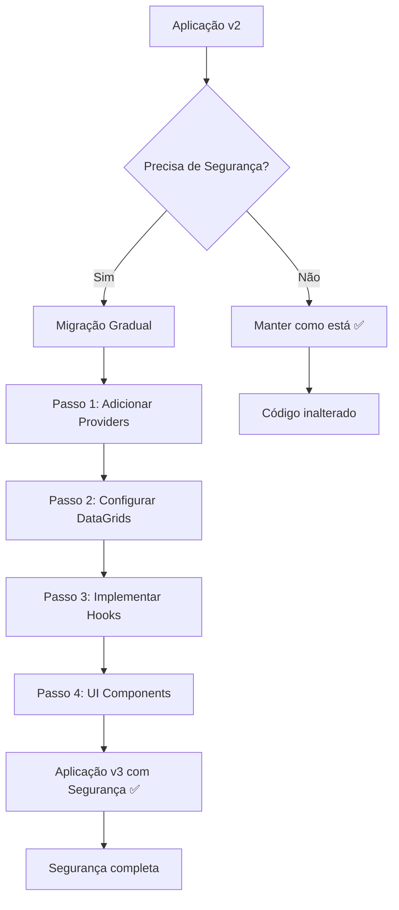

# Guia de Migração - Sistema de Segurança Archbase React v3

## 📋 Índice

- [Visão Geral da Migração](#visão-geral-da-migração)
- [Compatibilidade](#compatibilidade)
- [Migração Passo a Passo](#migração-passo-a-passo)
- [Cenários de Migração](#cenários-de-migração)
- [Breaking Changes](#breaking-changes)
- [Checklist de Migração](#checklist-de-migração)
- [Solução de Problemas](#solução-de-problemas)

---

## 🎯 Visão Geral da Migração

### O que mudou na v3?

✅ **Novo na v3:**
- Sistema de segurança integrado e opcional
- Segurança nativa no DataGrid (colunas)
- Templates com segurança automática
- Hooks de segurança
- Novos pacotes: `@archbase/security-ui`

✅ **Mantido da v2:**
- Toda API existente
- Compatibilidade total
- Performance preservada
- Componentes funcionam igual

### Estratégia de Migração



---

## ✅ Compatibilidade

### 100% Compatível

```typescript
// ✅ V2 - Continua funcionando igual na V3
function ExistingComponent() {
  return (
    <ArchbaseDataGrid dataSource={dataSource}>
      <Columns>
        <ArchbaseDataGridColumn dataField="name" header="Nome" />
        <ArchbaseDataGridColumn dataField="email" header="Email" />
      </Columns>
    </ArchbaseDataGrid>
  );
}

// ✅ Templates V2 - Funcionam igual na V3
function ExistingTemplate() {
  return (
    <ArchbaseGridTemplate
      title="Usuários"
      dataSource={dataSource}
      columns={columns}
      userActions={{
        visible: true,
        onAddExecute: handleAdd,
        onEditExecute: handleEdit
      }}
    />
  );
}
```

### Novos Recursos Opcionais

```typescript
// 🆕 V3 - Recursos novos (opcionais)
function EnhancedComponent() {
  return (
    <ArchbaseDataGrid 
      dataSource={dataSource}
      resourceName="users" // 🆕 Ativa segurança
    >
      <Columns>
        <ArchbaseDataGridColumn dataField="name" header="Nome" />
        <ArchbaseDataGridColumn 
          dataField="email" 
          header="Email"
          viewPermission="view_email" // 🆕 Segurança de coluna
        />
      </Columns>
    </ArchbaseDataGrid>
  );
}
```

---

## 🚀 Migração Passo a Passo

### Passo 1: Instalação e Configuração Inicial

#### 1.1 Instalar Novos Pacotes

```bash
# Se ainda não tem
npm install @archbase/security @archbase/security-ui

# Ou atualizar versão
npm install @archbase/security@latest @archbase/security-ui@latest
```

#### 1.2 Configuração Básica (Opcional)

```typescript
// app.tsx - ANTES (V2)
function App() {
  return (
    <div>
      <Router>
        <Routes>
          <Route path="/users" element={<UsersList />} />
          <Route path="/admin" element={<AdminPanel />} />
        </Routes>
      </Router>
    </div>
  );
}

// app.tsx - DEPOIS (V3) - Opcional
import { ArchbaseSecurityProvider } from '@archbase/security';

function App() {
  return (
    <ArchbaseSecurityProvider 
      resourceName="main_app" // Opcional
      autoRegisterActions={true} // Opcional
    >
      <Router>
        <Routes>
          <Route path="/users" element={<UsersList />} />
          <Route path="/admin" element={<AdminPanel />} />
        </Routes>
      </Router>
    </ArchbaseSecurityProvider>
  );
}
```

### Passo 2: Migração de DataGrids

#### 2.1 DataGrid Simples

```typescript
// ANTES (V2) - Funciona igual na V3
function SimpleDataGrid() {
  return (
    <ArchbaseDataGrid dataSource={dataSource}>
      <Columns>
        <ArchbaseDataGridColumn dataField="name" header="Nome" />
        <ArchbaseDataGridColumn dataField="email" header="Email" />
        <ArchbaseDataGridColumn dataField="salary" header="Salário" />
      </Columns>
    </ArchbaseDataGrid>
  );
}

// DEPOIS (V3) - Com segurança opcional
function SecureDataGrid() {
  return (
    <ArchbaseDataGrid 
      dataSource={dataSource}
      resourceName="employee_data" // 🆕 Ativa segurança
    >
      <Columns>
        <ArchbaseDataGridColumn dataField="name" header="Nome" />
        <ArchbaseDataGridColumn 
          dataField="email" 
          header="Email"
          viewPermission="view_email" // 🆕 Proteger coluna
        />
        <ArchbaseDataGridColumn 
          dataField="salary" 
          header="Salário"
          viewPermission="view_salary"
          fallbackContent="Confidencial" // 🆕 Fallback
        />
      </Columns>
    </ArchbaseDataGrid>
  );
}
```

#### 2.2 DataGrid com Configuração Avançada

```typescript
// Migração gradual - adicionar recursos conforme necessário
function AdvancedMigration() {
  return (
    <ArchbaseDataGrid 
      dataSource={dataSource}
      resourceName="financial_data"
      columnSecurityOptions={{ // 🆕 Configuração global
        defaultFallback: "🔒 Restrito",
        permissionPrefix: "finance_"
      }}
    >
      <Columns>
        <ArchbaseDataGridColumn dataField="client" header="Cliente" />
        <ArchbaseDataGridColumn 
          dataField="revenue" 
          header="Receita"
          viewPermission="view_revenue" // Vira "finance_view_revenue"
        />
        <ArchbaseDataGridColumn 
          dataField="cost" 
          header="Custo"
          viewPermission="view_cost"
          hideWhenNoPermission={true} // 🆕 Ocultar coluna
        />
      </Columns>
    </ArchbaseDataGrid>
  );
}
```

### Passo 3: Migração de Templates

#### 3.1 GridTemplate

```typescript
// ANTES (V2) - Funciona igual
function UserGridTemplate() {
  return (
    <ArchbaseGridTemplate
      title="Usuários"
      dataSource={userDataSource}
      filterType="advanced"
      userActions={{
        visible: true,
        onAddExecute: handleAdd,
        onEditExecute: handleEdit,
        onRemoveExecute: handleDelete
      }}
      columns={columns}
    />
  );
}

// DEPOIS (V3) - Com segurança automática
function SecureUserGridTemplate() {
  return (
    <ArchbaseGridTemplate
      title="Usuários"
      dataSource={userDataSource}
      filterType="advanced"
      
      // 🆕 Segurança do template
      resourceName="user_management"
      resourceDescription="Gerenciamento de Usuários"
      requiredPermissions={['view_users']} // Permissão para acessar
      
      userActions={{
        visible: true,
        onAddExecute: handleAdd,    // Auto-registra "add" action
        onEditExecute: handleEdit,  // Auto-registra "edit" action
        onRemoveExecute: handleDelete // Auto-registra "delete" action
      }}
      columns={columns}
    />
  );
}
```

### Passo 4: Adicionando Hooks de Segurança

#### 4.1 Substituir Verificações Manuais

```typescript
// ANTES (V2) - Verificação manual
function UserActions() {
  const [canEdit, setCanEdit] = useState(false);
  const [canDelete, setCanDelete] = useState(false);
  
  useEffect(() => {
    // Lógica manual de verificação
    checkUserPermissions().then(permissions => {
      setCanEdit(permissions.includes('edit_user'));
      setCanDelete(permissions.includes('delete_user'));
    });
  }, []);
  
  return (
    <div>
      {canEdit && <button onClick={handleEdit}>Editar</button>}
      {canDelete && <button onClick={handleDelete}>Excluir</button>}
    </div>
  );
}

// DEPOIS (V3) - Com hooks de segurança
import { useArchbasePermissionCheck } from '@archbase/security';

function SecureUserActions() {
  const canEdit = useArchbasePermissionCheck('edit_user');
  const canDelete = useArchbasePermissionCheck('delete_user');
  
  return (
    <div>
      {canEdit && <button onClick={handleEdit}>Editar</button>}
      {canDelete && <button onClick={handleDelete}>Excluir</button>}
    </div>
  );
}
```

#### 4.2 Componentes com Segurança Complexa

```typescript
// ANTES (V2) - Estado manual
function AdminPanel() {
  const [userPermissions, setUserPermissions] = useState<string[]>([]);
  
  useEffect(() => {
    loadUserPermissions().then(setUserPermissions);
  }, []);
  
  const hasPermission = (permission: string) => {
    return userPermissions.includes(permission);
  };
  
  return (
    <div>
      {hasPermission('view_users') && <UsersList />}
      {hasPermission('view_reports') && <ReportsDashboard />}
    </div>
  );
}

// DEPOIS (V3) - Com hook de segurança
import { useArchbaseSecurity } from '@archbase/security';

function SecureAdminPanel() {
  const security = useArchbaseSecurity();
  
  // Registrar ações dinamicamente
  useEffect(() => {
    security.registerAction('access_admin_panel', 'Acessar Painel Admin');
  }, [security]);
  
  if (!security.isAvailable) {
    // Sistema funciona sem segurança
    return <RegularAdminPanel />;
  }
  
  return (
    <div>
      {security.hasPermission('view_users') && <UsersList />}
      {security.hasPermission('view_reports') && <ReportsDashboard />}
    </div>
  );
}
```

### Passo 5: Migração de UI Components

#### 5.1 Substituir Modais Customizados

```typescript
// ANTES (V2) - Modal customizado
import { Modal } from '@mantine/core';

function CustomUserModal() {
  return (
    <Modal opened={opened} onClose={onClose}>
      {/* Formulário manual */}
      <form>
        <input name="name" placeholder="Nome" />
        <input name="email" placeholder="Email" />
        <button type="submit">Salvar</button>
      </form>
    </Modal>
  );
}

// DEPOIS (V3) - Modal pronto
import { UserModal } from '@archbase/security-ui';

function StandardUserModal() {
  return (
    <UserModal
      dataSource={userDataSource}
      opened={opened}
      onClickOk={handleSave}
      onClickCancel={handleCancel}
      options={{
        showNickname: true,
        showGroups: true,
        showProfiles: true
      }}
    />
  );
}
```

---

## 📋 Cenários de Migração

### Cenário 1: Aplicação Simples (Sem Segurança)

**Situação:** Aplicação pequena que não precisa de segurança.

**Ação:** Nenhuma mudança necessária.

```typescript
// ✅ Continua funcionando igual
function SimpleApp() {
  return (
    <ArchbaseDataGrid dataSource={dataSource}>
      <Columns>
        <ArchbaseDataGridColumn dataField="name" header="Nome" />
      </Columns>
    </ArchbaseDataGrid>
  );
}
```

### Cenário 2: Aplicação com Segurança Básica

**Situação:** Precisa de controle básico de acesso.

**Migração:**
1. Adicionar ArchbaseSecurityProvider no root
2. Configurar resourceName nos components principais
3. Adicionar permissões em colunas sensíveis

```typescript
// 1. Root da aplicação
<ArchbaseSecurityProvider resourceName="app">
  <App />
</ArchbaseSecurityProvider>

// 2. Components com segurança básica
<ArchbaseDataGrid 
  dataSource={dataSource}
  resourceName="users"
>
  <Columns>
    <ArchbaseDataGridColumn dataField="name" header="Nome" />
    <ArchbaseDataGridColumn 
      dataField="email" 
      header="Email"
      viewPermission="view_email"
    />
  </Columns>
</ArchbaseDataGrid>
```

### Cenário 3: Sistema Empresarial Complexo

**Situação:** Sistema grande com múltiplos módulos e níveis de acesso.

**Migração Planejada:**

#### Fase 1: Infraestrutura
```typescript
// Implementar SecurityManager customizado
class EnterpriseSecurityManager extends ArchbaseSecurityManager {
  async hasPermission(permission: string): Promise<boolean> {
    return await this.enterpriseAPI.checkPermission(permission);
  }
}

// Configurar Provider principal
<ArchbaseSecurityProvider 
  manager={new EnterpriseSecurityManager()}
  resourceName="enterprise_system"
>
  <App />
</ArchbaseSecurityProvider>
```

#### Fase 2: Módulo por Módulo
```typescript
// Módulo de RH
<ArchbaseViewSecurityProvider 
  viewName="hr_module"
  requiredPermissions={['access_hr']}
>
  <HRModule />
</ArchbaseViewSecurityProvider>

// Módulo Financeiro
<ArchbaseViewSecurityProvider 
  viewName="finance_module"
  requiredPermissions={['access_finance']}
>
  <FinanceModule />
</ArchbaseViewSecurityProvider>
```

#### Fase 3: Componentes Granulares
```typescript
// DataGrids com segurança detalhada
<ArchbaseDataGrid 
  resourceName="employee_data"
  columnSecurityOptions={{
    permissionPrefix: "hr_",
    defaultFallback: "Confidencial"
  }}
>
  <Columns>
    <ArchbaseDataGridColumn 
      dataField="salary" 
      viewPermission="view_salary"
      hideWhenNoPermission={true}
    />
  </Columns>
</ArchbaseDataGrid>
```

### Cenário 4: Migração de Sistema Legacy

**Situação:** Sistema antigo com segurança customizada existente.

**Estratégia:**
1. Manter sistema antigo funcionando
2. Implementar adapter para SecurityManager
3. Migrar componente por componente

```typescript
// Adapter para sistema legacy
class LegacySecurityAdapter extends ArchbaseSecurityManager {
  constructor(private legacySecurityService: LegacySecurityService) {
    super();
  }
  
  async hasPermission(permission: string): Promise<boolean> {
    // Adaptar para API legacy
    const legacyPermission = this.mapToLegacyPermission(permission);
    return await this.legacySecurityService.checkAccess(legacyPermission);
  }
  
  private mapToLegacyPermission(permission: string): string {
    // Mapeamento de permissões
    const mapping = {
      'view_users': 'USER_READ',
      'edit_users': 'USER_WRITE',
      'delete_users': 'USER_DELETE'
    };
    return mapping[permission] || permission;
  }
}
```

---

## ⚠️ Breaking Changes

### Nenhum Breaking Change Real

✅ **A migração para v3 é 100% compatível - não há breaking changes.**

### Mudanças Estruturais (Internas)

#### Separação de Pacotes
- ✅ `@archbase/security` - Core (logic, services, hooks)
- ✅ `@archbase/security-ui` - UI Components (modals, views)

#### Imports que Mudaram (Apenas para novos recursos)

```typescript
// 🆕 Novos imports (apenas se usar novos recursos)
import { 
  UserModal, 
  GroupModal, 
  ArchbaseSecurityView 
} from '@archbase/security-ui';

import { 
  useArchbaseSecurity,
  ArchbaseSecurityProvider 
} from '@archbase/security';
```

### Deprecações (Warnings apenas)

```typescript
// ⚠️ Deprecated (ainda funciona, mas com warning)
import { ProfileModal } from '@archbase/security'; // Warning

// ✅ Novo caminho recomendado
import { ProfileModal } from '@archbase/security-ui'; // Preferred
```

---

## ✅ Checklist de Migração

### Pré-Migração

- [ ] **Backup do código atual**
- [ ] **Documentar funcionalidades de segurança existentes**
- [ ] **Listar componentes que precisam de segurança**
- [ ] **Definir permissões necessárias**

### Migração Básica

- [ ] **Instalar pacotes: `@archbase/security` e `@archbase/security-ui`**
- [ ] **Adicionar ArchbaseSecurityProvider (opcional)**
- [ ] **Testar que tudo funciona igual**

### Migração com Segurança

- [ ] **Implementar SecurityManager customizado (se necessário)**
- [ ] **Configurar resourceName nos DataGrids principais**
- [ ] **Adicionar viewPermission em colunas sensíveis**
- [ ] **Configurar Templates com segurança**
- [ ] **Substituir verificações manuais por hooks**

### Migração Avançada

- [ ] **Implementar UI components (@archbase/security-ui)**
- [ ] **Configurar providers específicos por módulo**
- [ ] **Implementar fallbacks customizados**
- [ ] **Configurar auto-registro de ações**
- [ ] **Testar todos os cenários de permissão**

### Pós-Migração

- [ ] **Executar testes completos**
- [ ] **Verificar performance**
- [ ] **Documentar novas configurações**
- [ ] **Treinar equipe**

---

## 🔧 Solução de Problemas

### Problema 1: "Hook não encontrado"

```typescript
// ❌ Erro
function Component() {
  const security = useArchbaseSecurity(); // Error: Hook não encontrado
}

// ✅ Solução
<ArchbaseSecurityProvider resourceName="app">
  <Component />
</ArchbaseSecurityProvider>
```

### Problema 2: "Segurança não funciona"

```typescript
// ❌ Problema: resourceName ausente
<ArchbaseDataGrid dataSource={dataSource}>
  <Columns>
    <ArchbaseDataGridColumn 
      dataField="email"
      viewPermission="view_email" // Não funciona sem resourceName
    />
  </Columns>
</ArchbaseDataGrid>

// ✅ Solução: Adicionar resourceName
<ArchbaseDataGrid 
  dataSource={dataSource}
  resourceName="users" // Ativa segurança
>
  <Columns>
    <ArchbaseDataGridColumn 
      dataField="email"
      viewPermission="view_email" // Agora funciona
    />
  </Columns>
</ArchbaseDataGrid>
```

### Problema 3: "Performance degradada"

```typescript
// ❌ Problema: Muitas verificações síncronas
const security = useArchbaseSecurity();

// Evitar verificações em loop
{data.map(item => (
  security.hasPermission('view') && <Item key={item.id} />
))}

// ✅ Solução: Verificar uma vez
const canView = useArchbasePermissionCheck('view');

{canView && data.map(item => (
  <Item key={item.id} />
))}
```

### Problema 4: "Imports não encontrados"

```typescript
// ❌ Problema: Import do lugar errado
import { UserModal } from '@archbase/security'; // Pode dar warning

// ✅ Solução: Import correto
import { UserModal } from '@archbase/security-ui';
```

---

## 📈 Migração Gradual Recomendada

### Semana 1: Preparação
- Instalar pacotes
- Configurar Provider básico
- Testar compatibilidade

### Semana 2: DataGrids Principais
- Adicionar resourceName
- Configurar colunas sensíveis
- Implementar fallbacks

### Semana 3: Templates e Forms
- Configurar segurança em templates
- Implementar hooks básicos
- Substituir verificações manuais

### Semana 4: UI Components
- Substituir modais customizados
- Implementar views complexas
- Configuração avançada

### Semana 5: Testes e Refinamento
- Testes completos
- Otimização de performance
- Documentação final

---

## 🎯 Próximos Passos

Após a migração bem-sucedida:

1. **Explore recursos avançados** - HOCs, wrappers automáticos
2. **Implemente analytics** - Rastreamento de ações de segurança
3. **Configure multi-tenant** - Segurança por tenant
4. **Otimize performance** - Cache de permissões, batch requests

**A migração é gradual e segura - comece pequeno e expanda conforme necessário!** 🚀